# WAMS - Warehouse Management System API

> **Scope:** Auth · Users · RBAC · Warehouse · Budget · Work Order · Recap · Quality · Document · Finance Report · RCA · Dashboard · Export

A secure, production-ready RESTful API for warehouse management built with **.NET 10**, **ASP.NET Core**, and **PostgreSQL**. Provides multi-tenancy support with company-based data isolation, role-based access control (RBAC) with wildcard permission support, JWT-based authentication with refresh token rotation, database migrations via Entity Framework Core, soft deletes, and comprehensive audit logging.

---

## Table of Contents

- [Overview](#overview)
- [Business Flow](#business-flow)
- [Architecture](#architecture)
- [Technology Stack](#technology-stack)
- [Project Structure](#project-structure)
- [Getting Started](#getting-started)
- [API Documentation](#api-documentation)
- [Configuration](#configuration)
- [Database Migrations](#database-migrations)
- [Authentication & Authorization](#authentication--authorization)
- [RBAC System](#rbac-system)
- [Workflow Templates](#workflow-templates)
- [Database Schema](#database-schema)
- [Audit Logging](#audit-logging)
- [File Attachments](#file-attachments)
- [API Endpoints](#api-endpoints)
- [Testing](#testing)
- [API Response Messages](#api-response-messages)
- [Budget Calculations & Formulas](#budget-calculations--formulas)
- [Tax Module: PPN & PPh](#tax-module-ppn--pph)
- [Caching](#caching)
- [Notification System](#notification-system)
- [Development Guide](#development-guide)
- [Deployment](#deployment)
- [Changelog](#changelog)

---

## Overview

WAMS handles the backend for multi-warehouse operations with fine-grained access control. The core domains are:

- **Multi-Tenancy** - Company-based data isolation with automatic tenant context filtering
- **Authentication** - JWT access tokens (15 min) + refresh tokens (7d) with process-local blacklisting during API uptime; login requires company selection
- **User Management** - CRUD with soft delete support, role and warehouse assignments
- **RBAC** - `Module.Resource.Action` permission structure with wildcard support (`*.*.*`, `*.*.read`) and seeded default roles
- **Company Management** - System-level company CRUD and user-to-company assignment (SUPER_ADMIN only)
- **Warehouse Management** - Read-only warehouse access scoped per user; master data (warehouses, vendors, items, SPKs) synced automatically from ERP via background scheduler and manual trigger endpoint; every sync run is recorded in `sync_logs` with outcome, row counts, and abort reason; ERP data is schema-validated before saving; scheduler warns in logs when a service has not succeeded within 2× the configured interval
- **Budget Management** - Activity type master, rate cards for vendor-specific item pricing, budget templates (Draft→Submitted→Approved/Rejected) defining cost structure per **location** (company-scoped, no warehouse FK - any user can view all templates), and a dynamic workflow engine for budget plan approvals (template-configured multi-stage flow: `Draft → Submitted → InApproval → Approved` with stage snapshots per submission). Budget plans are created by Warehouse Admins and carry a direct warehouse FK (`warehouse_shadow_id`); the chosen warehouse must belong to the template's location. Prices are snapshotted from rate cards at creation time; each plan can link multiple SPK (work order) base documents; and purchase orders (Draft→Generated) lock approved budget plan items and generate PO numbers via SAP B1 integration.
  **When a plan gets rejected, it goes back to being editable, same as a brand-new Draft** - the creator can change the warehouse, remark, document date, the SPK list, and the cost items, then resubmit it to start approval over again. The one catch: once a work order has been created off a cost item (even later cancelled), that item can no longer be deleted or split into multiple rows - only its cost and quantity can still be changed, and if the work order is still active, the new total can't be lowered below what's already been committed to it. Cost items that never had a work order can still be freely added, changed, or removed.
- **Work Order Management** - Work order lifecycle (`Draft → Submitted`) built from `Approved` budget plans. **Stub Draft WOs are auto-created atomically when a Budget Plan reaches final approval** - one WO per `BudgetPlanItem`, in the same DB transaction as the approval commit. The WO code (`WO.YYMMnnnnnn`) is assigned immediately, making it visible to the frontend from day one without any manual create step. The frontend fills in operational fields (`picUserId`, dates, activity detail) via `PUT /work-orders/{id}` and submits via `POST /work-orders/{id}/submit`. Each WO carries an activity-specific payload (Unloading, Loading, Fumigation, Storage, QC, Heavy Equipment, Unbagging, Rebagging) determined by the budget template's activity type. **GPS location** (`GpsCoordinate` value object: lat/lon/accuracy/recordedAt) is optional on update but enforced at submit time - the server validates GPS is present before any DB write, so a missing-GPS error leaves the WO in `Draft`. GPS columns are stored flat on `work_orders` with a DB check constraint ensuring coherence (all four columns are either all-null or all-non-null). Supports file attachments and transport order linking.
- **Recap Work Order** - One recap record per Budget Plan, auto-created via `INSERT ... ON CONFLICT DO NOTHING` (race-safe) at either of two trigger points: the first WO submission for that BP, or - as of the BP's final approval stage - immediately alongside the bulk Draft-WO creation, so the recap is visible (`Pending`, 0 realization) from the moment Draft WOs exist instead of only after a foreman submits one. Gives WH Admin a side-by-side Plan vs. Realization view (budget vs. actuals across all WOs) with approval/rejection workflow (`Pending → Approved | Rejected`). Approving locks all Work Orders under the BP - mutations return `409 Conflict`; lock is derived from recap status, no schema change needed. Rejecting a recap also sets its parent Budget Plan to `Rejected` in the same call, so the plan drops straight back into the editable state described below. Scoped to the reviewer's warehouse. Realization figures are computed from physical WO records (NettWeight, VolumeWeight, TotalCost, etc.) using activity-type-specific formulas - no foreman-entered cost fields required.
- **Account Payables** - AP generation by HO from `Approved` recap work orders. Vendor-centric: one AP can span multiple recaps/BPs belonging to the same vendor. Items are snapshotted from `BudgetPlanItem`, reserved while the AP is a Draft, and locked after Generate - identical locking rule to PO, including a copied-forward `IsRfba` flag per item; a single AP cannot mix both. PO and AP create/update use database row locks to prevent concurrent double attachment. SAP generation uses an owner token with a 15-minute recovery lease, conditional finalization, and `409 Conflict` for a competing request; update/delete are blocked while generation is active. SAP B1 integration is a PO-first flow via `ISapApiClient`: a generated RFBA PO creates its standalone APDP through `POST /purchase-orders/{id}/generate-apdp`, while AP generation posts only to `/WAMS/APInvoice` and draws one or more PO-owned APDP documents through `tapdp`; non-RFBA (`IsRfba=false`) APs post straight to `/WAMS/APInvoice` with an accumulated withholding-tax (`whTax`) array (mock enabled by default via `ErpApi:UseMockSap`). AP code format: `AP-YYMMnnnnnn`. Each AP carries an optional manual **discount** - a single nominal Rupiah amount, server-computed into every displayed total (`AccountPayableTotalsCalculator`, the sole place this math is written) and converted to a per-line `discountPercent` on the SAP invoice. A stateless `POST /account-payables/preview` endpoint returns the same computed totals for an unsaved item/discount selection and applies the caller's warehouse scope, so the frontend never has to replicate the arithmetic client-side.
- **Quality Control** - Fumigation scheduling and moisture content monitoring (planned)
- **Work Order Attachments** - File attachments on work orders (upload, list, download, delete) with MIME validation, magic-byte signature check, tenant isolation, and swappable storage backend. Access is inherited from the parent work order, including its warehouse scope
- **Finance Report** - Read-only view over `Approved` budget plans for finance users. List page reuses the same query as `GET /purchase-orders/approved-budget-plans` (budget totals, approved/variance, linked PO numbers, search + sort). Detail page joins each `PurchaseOrderItem` to its `WorkOrder` (via `BudgetPlanItemId`) to build a per-cost-line table (WO code, BL number, vessel, product, PIC, RFBA, dates, PPN/PPh breakdown, per-line payment status) plus a budget plan/realization/variance recap. Scoped by warehouse access, with an explicit warehouse-assignment check (not just the trusted header) before returning detail data. Permission: `report.finance-report.read` (FINANCE_USER, HO_SPV, WAREHOUSE_ADMIN). `GET /{budgetPlanId}/export` exports the cost-detail rows (`.xlsx`/`.csv`/`.pdf`); an optional `workOrderId` filter scopes the export to a single Work Order's rows instead of the whole budget plan. Permission: `report.finance-report.export`
- **RCA (Rekapitulasi Kas Operasional)** - On-demand A4 landscape PDF summarising all warehouse operational costs for a selected warehouse and date range. Finance picks warehouse code + date range; the system generates a document with: company header + logo, 11-column cost detail table with row totals, per-pos biaya summary grid, and a 4-slot signature section auto-filled from the budget plan workflow stages. RCA ID format: `{seq}/RCA/{companyCode}/{warehouseCode}/{dateTo:ddMMMyyyy}`. Not stored in DB. Gated by its own `rca.report.export` permission (granted to SUPER_ADMIN via `*.*.*` and FINANCE_USER only).
- **Dashboard** - Three KPI endpoints: summary (budget achievement %, POs without AP, open WOs, pending approvals), today's work order activity feed (paginated, searchable), and monthly history (calendar event dot counts + last 20 events). All queries are warehouse-scoped using the same warehouse-shadow ID resolution as other report endpoints. Permission: `report.dashboard.read` (FINANCE_USER, HO_SPV, WAREHOUSE_ADMIN)
- **Export** - `GET /export` on all 16 paginated list endpoints. Returns `.xlsx` (SpreadCheetah), `.csv` (CsvHelper), or `.pdf` (QuestPDF) via `?format=Xlsx|Csv|Pdf`. PDF output is report-style: company name from the tenant context, configurable logo, auto-derived title, UTC timestamp, styled data table, and page numbers - rendered on A4 landscape via QuestPDF (MIT community license). Accepts the same filter/sort params as the list endpoint; ignores pagination and returns all matching rows. Uses the caller's existing read permission - no separate export permission required. File is streamed directly to the response body.
- **Database Migrations** - Version-controlled schema using Entity Framework Core
- **Observability** - Structured Serilog logging, distributed request ID tracing, audit trail, PostgreSQL health checks at `/health`, OpenTelemetry traces + metrics with OTLP export (works with SigNoz, Grafana Tempo, Datadog, Honeycomb, or any OTLP-compatible backend), Prometheus scrape at `/metrics`, and custom business counters (budget plans, work orders, recap approvals, ERP sync, auth)
- **Caching** - Local-only `HybridCache` with tag-based invalidation. Caches RBAC permission checks (every request), UoM, activity types, workflow templates, warehouse shadow data, and rate card lookups. Decorator pattern keeps business logic cache-free; all invalidation is co-located with writes. See [Caching](#caching) for the full strategy.
- **Resilience** - Polly v8 retry (3×, exponential backoff + jitter), circuit breaker (50% failure threshold, 30s window), and per-attempt timeout on ERP sync HTTP client; rate limiting (sliding window, 10 req/min per IP) on auth endpoints; Brotli/Gzip response compression on all JSON payloads

---

## Business Flow

### Login & Request Lifecycle

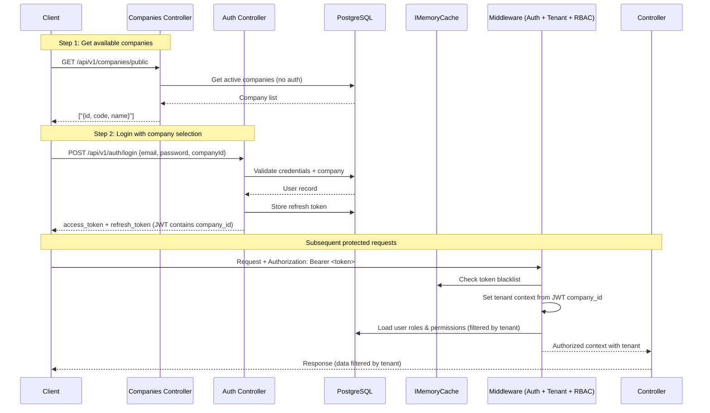

### User Onboarding Flow

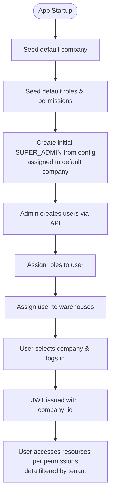

### Permission Check Flow

Permission resolution follows a strict priority order: **Explicit Deny > Explicit Grant > Role Grant > Default Deny**

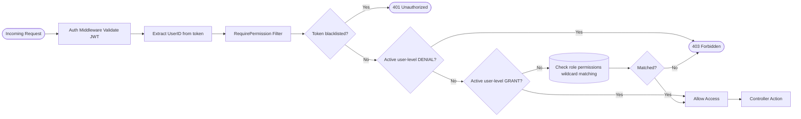

### Warehouse Scoping

WAMS implements **two-layer access control** for warehouse operations:

1. **RBAC Permissions**: `user.warehouse.read`, `user.warehouse.create`, etc.
2. **Warehouse Scope**: Either global access OR assigned warehouses

#### How Warehouse Scoping Works

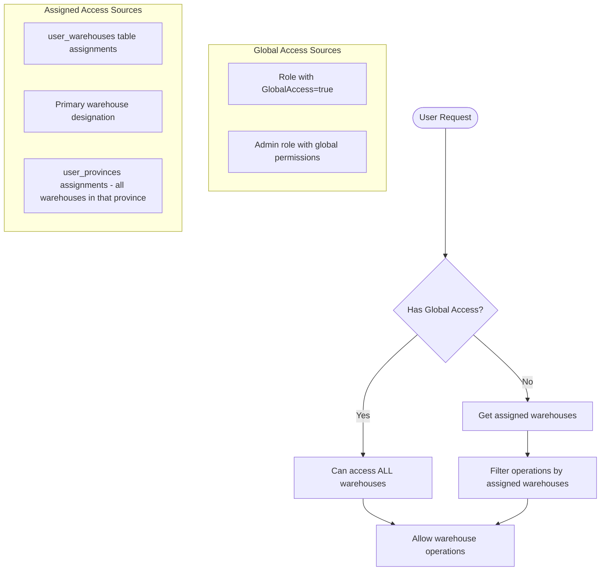

#### Warehouse Scope Rules

| User Type | Warehouse Access | Example |
|-----------|------------------|---------|
| **Global Access** (`GlobalAccess=true`) | **All warehouses** | SUPER_ADMIN, HO_SPV, FINANCE_USER |
| **Assigned Access** (`GlobalAccess=false`) | **Union of directly assigned warehouses, warehouses in assigned provinces, and the `GLOBAL` province** | WAREHOUSE_HEAD, WAREHOUSE_ADMIN, FOREMAN |
| **No Assignments** | **Empty results / 403** | New user without warehouse or province assignments |

#### Province & Region Scoping

Warehouses and Budget Templates carry a `ProvinceId`, resolved automatically rather than assigned by hand:

- **Warehouses** get their province from `WarehouseSyncService` matching the ERP `location` text (normalized: trimmed, whitespace-collapsed, uppercased) against the `provinces` and `province_aliases` tables on every sync run. A warehouse whose location matches nothing keeps `ProvinceId = null` and surfaces to global-access admins via `GET /warehouses/unmapped`.
- **Budget Templates** get their province the same way, resolved server-side from the free-text `location` field on create/update. An unrecognized value is rejected with `400`.
- A synthetic `GLOBAL` province is seeded alongside the real ones; every user - scoped or global - implicitly has access to it, so a warehouse or template pinned to `GLOBAL` is visible company-wide without an explicit assignment.
- A Budget Plan's warehouse must share its template's `ProvinceId` (`null` matches `null`) - enforced at create/update time, independent of the ERP location text.

See [ENDPOINTS.md § Province & Region Scoping](ENDPOINTS.md#province--region-scoping) for the full endpoint-level breakdown.

### Multi-Tenancy (Company Isolation)

WAMS implements **company-based multi-tenancy** for complete data isolation between organizations:

#### How Multi-Tenancy Works

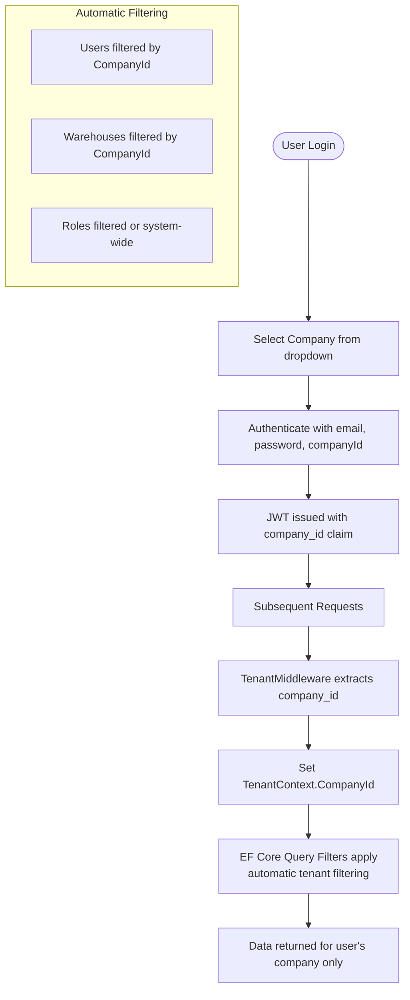

#### Tenant Context Flow

1. **Login**: User selects company from public endpoint, sends `{email, password, companyId}`. For a regular user, `companyId` must match their own `User.CompanyId` or login fails with `InvalidCredentials`. For a Super Admin (`*.*.*` wildcard), `companyId` selects which company to act as for this session - it must exist and be active.
2. **JWT Generation**: the *acting* `company_id` (not necessarily the user's home company) is embedded as a claim in the access token, and stamped on the issued `RefreshToken` row too
3. **Request Processing**: `TenantMiddleware` extracts `company_id` from the JWT and calls `SetCompanyId(companyId)` - unconditionally, for every authenticated user including Super Admin
4. **Query Filtering**: EF Core global query filters always scope queries by `CompanyId`. There is no bypass/see-all mode for authenticated requests - a Super Admin sees exactly one company's data per session, chosen at login
5. **Auto-Assignment**: New entities automatically get the acting `CompanyId` on save
6. **Refresh**: `POST /auth/refresh` re-issues a token for the same acting `CompanyId` stored on the refresh token row - a Super Admin does not need to re-select a company on every refresh, but switching companies requires a fresh login

#### Key Components

| Component | Purpose |
|-----------|---------|
| [`Company`](src/WAMS.Domain/Entities/Company.cs) | Tenant entity with Code, Name, IsActive |
| [`ITenantContext`](src/WAMS.Application/Interfaces/ITenantContext.cs) | Holds current request's CompanyId (always set for authenticated requests; null only for code paths outside the HTTP pipeline, e.g. background jobs) |
| [`TenantContext`](src/WAMS.Infrastructure/Services/TenantContext.cs) | Implementation of tenant context |
| [`TenantMiddleware`](src/WAMS.Api/Middleware/TenantMiddleware.cs) | Extracts `company_id` from JWT and calls `SetCompanyId()` for every authenticated request |
| [`AppDbContext`](src/WAMS.Infrastructure/Data/AppDbContext.cs) | Query filters for automatic tenant isolation |

#### Public Endpoints (No Tenant Context)

Some endpoints bypass tenant filtering:
- `GET /api/v1/companies/public` - List active companies for login dropdown
- `POST /api/v1/auth/login` - Authentication (tenant not yet known)

These use `IgnoreQueryFilters()` to access all data without tenant scoping.

### Company Management (System Administration)

Company management is a **system-level operation** that operates outside the tenant boundary. Only SUPER_ADMIN users with `system.company.*` permissions can manage companies.

#### Key Design Decisions

1. **SUPER_ADMIN Still Belongs to a Company**: Every user has a `CompanyId` (NOT NULL). SUPER_ADMIN belongs to the DEFAULT company by default, but at login can pick any active company to act as - the JWT's `company_id` claim reflects that choice, not necessarily `user.CompanyId`. Their system-wide power comes from:
   - `*.*.*` permission (bypasses all RBAC checks)
   - `GlobalAccess = true` on the role (bypasses warehouse scoping)
   - The ability to log in as any company, one at a time - there is no cross-company "see everything" mode. `TenantMiddleware` always calls `SetCompanyId()` and the tenant query filter always applies, for Super Admin included

2. **New Permission Module**: `system.company.*` permissions are separate from `user.*` because company management operates outside the tenant boundary.

#### Company Management API

```bash
# List all companies (requires system.company.read)
curl http://localhost:8080/api/v1/companies \
  -H "Authorization: Bearer <super_admin_token>"

# Create a new company
curl -X POST http://localhost:8080/api/v1/companies \
  -H "Authorization: Bearer <super_admin_token>" \
  -H "Content-Type: application/json" \
  -d '{"code":"ACME","name":"ACME Corporation","address":"123 Main St"}'

# Update a company
curl -X PUT http://localhost:8080/api/v1/companies/2 \
  -H "Authorization: Bearer <super_admin_token>" \
  -H "Content-Type: application/json" \
  -d '{"name":"ACME Corp Updated"}'

# Deactivate a company (soft delete)
curl -X DELETE http://localhost:8080/api/v1/companies/2 \
  -H "Authorization: Bearer <super_admin_token>"

# Move a user to a different company (clears warehouse assignments)
curl -X POST http://localhost:8080/api/v1/companies/2/users/5 \
  -H "Authorization: Bearer <super_admin_token>"
```

> **Note**: When a user is moved to a different company, their warehouse assignments are automatically cleared to prevent stale cross-company assignments.

### Purchase Order Flow

Purchase orders are created from **approved budget plan items** and sent to SAP B1 to generate a real PO number. The flow sits between Budget Plan approval and work order realization.

#### Status Lifecycle

```
Draft → Generated
```

Only `Draft` POs can be edited or deleted. Calling `/generate` is irreversible - it contacts SAP and locks all included items.

#### Item Locking Rule

Each `BudgetPlanItem` can appear in **at most one non-deleted PO**. Items included in either a `Draft` or `Generated` PO are reserved, so they are not available to another PO. When editing a Draft PO, use the route-based picker so the backend can exclude that PO's own items safely.

#### Typical Usage

**Step 1 - Load the cross-warehouse item picker from an active-warehouse seed BP**

```bash
curl "http://localhost:8080/api/v1/purchase-orders/available-items?budgetPlanId=226&vendorShadowId=1&page=1&limit=20" \
  -H "Authorization: Bearer <token>" \
  -H "X-Warehouse-Id: 103"
```

Returns a paginated set of items for the selected vendor, spanning every warehouse accessible to the caller. When supplied, the seed BP must belong to the active `X-Warehouse-Id`; without the header, the server falls back to the caller's accessible warehouse scope. `vendorShadowId` is required so the picker cannot return rows from multiple vendors. The user then checks individual available rows - checked item IDs are passed in the create body, and the server revalidates access and availability.

**Step 2 - Create a Draft PO**

```bash
curl -X POST http://localhost:8080/api/v1/purchase-orders \
  -H "Authorization: Bearer <token>" \
  -H "Content-Type: application/json" \
  -d '{
    "vendorShadowId": 5,
    "docDate": "2026-04-30T00:00:00Z",
    "remark": "Monthly procurement April",
    "items": [42, 43, 44]
  }'
```

- All items must belong to the specified vendor.
- Item display fields (code, name, price, UoM) are **snapshotted** at creation - editing the original budget plan item later does not affect the PO.
- A PO code is auto-generated in format `PO-YYMMnnnnnn` (e.g. `PO-2604000001`).

**Step 3 - (Optional) Update the Draft**

```bash
curl -X PUT http://localhost:8080/api/v1/purchase-orders/1 \
  -H "Authorization: Bearer <token>" \
  -H "Content-Type: application/json" \
  -d '{
    "remark": "Updated remark",
    "items": [42, 45]
  }'
```

All fields are optional. If `items` is provided, the item list is fully replaced (previous items are removed and re-snapshotted).

**Step 4 - Generate to SAP**

```bash
curl -X POST http://localhost:8080/api/v1/purchase-orders/1/generate \
  -H "Authorization: Bearer <token>"
```

- Calls the SAP B1 integration and stores the returned SAP PO number.
- Status changes from `Draft` → `Generated`.
- All included items are now locked for other POs.
- The response includes `sapPoNumber` from SAP.

#### SAP Integration Toggle

The SAP client is switchable via `appsettings.json` without code changes:

```json
"SapApi": {
  "UseMock": true
}
```

| `UseMock` | Behaviour |
|-----------|-----------|
| `true` (default) | `MockSapApiClient` - returns a fake `SAP-PO-{guid}` instantly, useful for dev/testing |
| `false` | `SapApiClient` - real HTTP call to SAP B1 HANA (BaseUrl must be configured) |

#### PO Flow Diagram

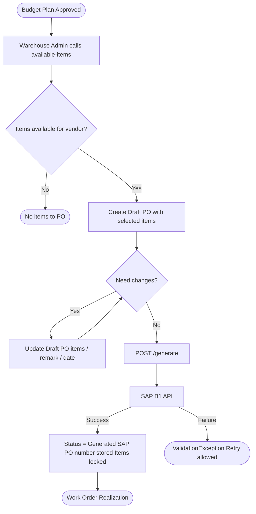

#### Recap Work Order Flow

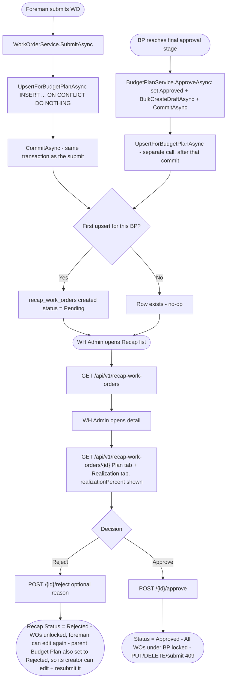

#### Account Payable Flow

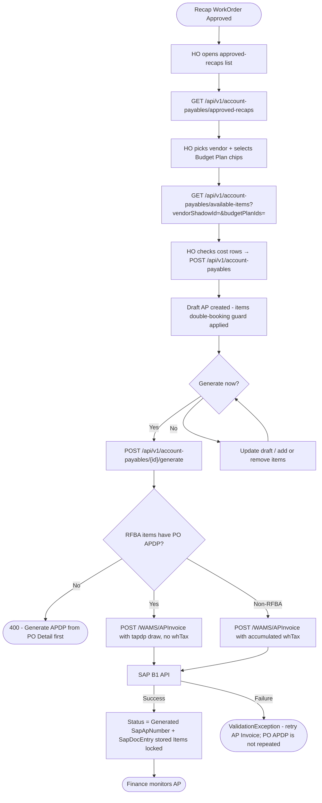

### Workflow Templates

A workflow template defines the approval chain for a document type. HO_SPV creates stages in order; each stage names the roles that can approve it. Only one template can be active per company + doc type at a time.

When a Warehouse Admin submits a budget plan, the server copies the active template into `workflow_instances` and `workflow_instance_stages`. Later template edits do not affect any in-flight approval - those snapshots are frozen at submission time.

Currently one doc type exists: `BudgetPlanApproval`. Doc types come from code, not admin configuration.

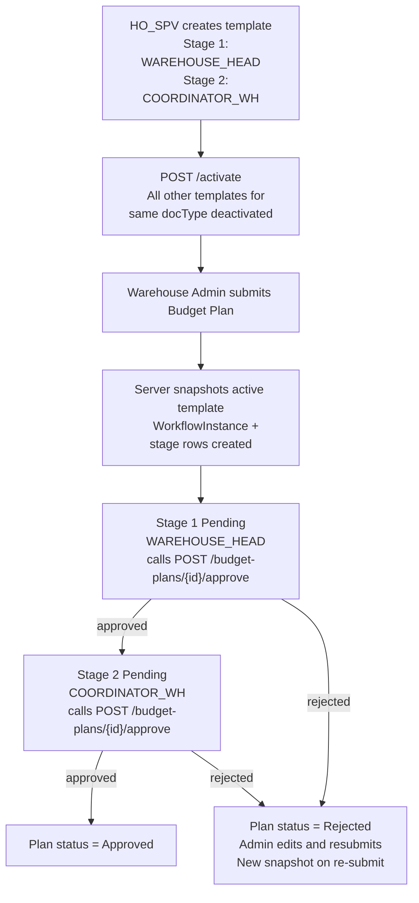

| Rule | Detail |
|------|--------|
| One active template per doc type | Activating a new one deactivates the previous active one in the same DB transaction |
| Snapshots are immutable | In-flight approvals use the snapshot, not the current template |
| DELETE blocked if used | `DELETE` returns `409` when any budget plan has used the template; deactivate instead |
| Full stage replacement | `PUT` with `stages` deletes all existing stages and inserts the new set atomically |
| Role check on approve | The server validates the caller's JWT roles against that stage's `approverRoles` list |

---

## Architecture

WAMS follows **Clean Architecture** with strict layer separation. Dependencies always point inward - the domain layer has zero external dependencies.

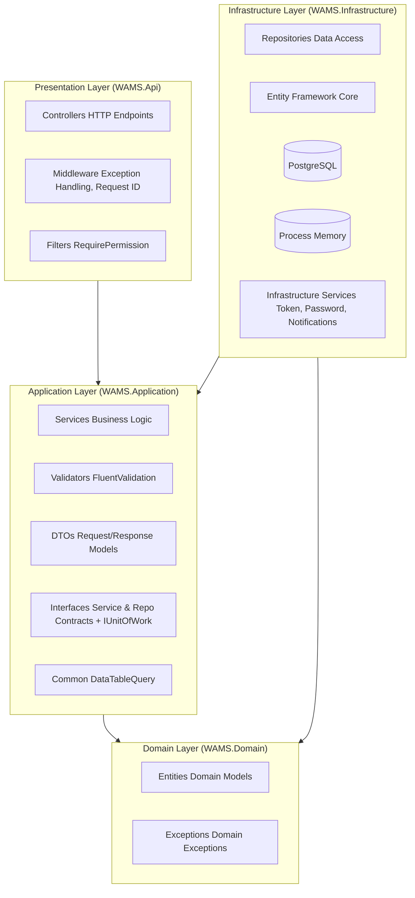

### Dependency Injection

Registration is split by layer, each layer owning its own composition root, so [`Program.cs`](src/WAMS.Api/Program.cs) stays focused on host bootstrap (Serilog, Kestrel, middleware pipeline) instead of also being where every new feature's services get wired:

```csharp
// Program.cs
builder.Services
    .AddApplicationServices()          // WAMS.Application/DependencyInjection.cs
    .AddInfrastructureServices(builder.Configuration);  // WAMS.Infrastructure/DependencyInjection.cs
```

- **`WAMS.Application/DependencyInjection.cs`** - `AddApplicationServices()` registers FluentValidation validators and plain business services (no caching decorator, no infra dependency): `IAuthService`, `IUserService`, `ICompanyService`, `IPurchaseOrderService`, etc.
- **`WAMS.Infrastructure/DependencyInjection.cs`** - `AddInfrastructureServices(IConfiguration)` registers everything backed by Infrastructure: repositories, `IUnitOfWork`, cache decorators (`Cached*Service` wrapping the real keyed implementation), external sync services + SAP client (mock/real toggle), email service, background services, and the seeders.

New feature → new repo/service registration goes in one of those two files, never in `Program.cs`, so a feature branch never conflicts with someone else's CORS/OTel/rate-limiter change landing in the same file.

---

## Technology Stack

| Component | Technology | Why |
|-----------|-----------|-----|
| Language | C# / .NET 10 | Modern, performant, strong typing |
| Web Framework | ASP.NET Core | Cross-platform, high-performance |
| ORM | Entity Framework Core | Flexible DB layer with migrations |
| Database | PostgreSQL | Primary data store |
| Migrations | EF Core Migrations | Version-controlled schema changes |
| Cache / Sessions | `HybridCache` + `IMemoryCache` | Process-local response caching, token blacklisting, and real-time notifications |
| Auth | JWT (Microsoft.IdentityModel) | Standard JWT implementation |
| Password Hashing | BCrypt | Adaptive, secure password storage |
| Validation | FluentValidation | Expressive validation rules |
| Resilience | Polly v8 (`Microsoft.Extensions.Http.Resilience`) | Retry + circuit breaker + timeout on ERP HTTP client |
| Rate Limiting | ASP.NET Core built-in (`RateLimiter`) | Sliding window per-IP on auth endpoints |
| Compression | ASP.NET Core built-in (Brotli + Gzip) | Response compression for all JSON payloads |
| Health Checks | `AspNetCore.HealthChecks.NpgSql` | Liveness probe at `/health` - PostgreSQL |
| Distributed Tracing | OpenTelemetry (`OpenTelemetry.Extensions.Hosting`) | Traces for HTTP requests, EF Core queries, outbound HTTP; OTLP export to any compatible backend (SigNoz, Tempo, etc.) |
| Metrics | OpenTelemetry (`System.Diagnostics.Metrics`) | Runtime, ASP.NET Core + custom business counters; Prometheus scrape at `/metrics` |
| Logging | Serilog | High-performance structured logging |
| Testing | xUnit + NSubstitute + FluentAssertions | Unit testing |
| Excel Export | SpreadCheetah | Forward-only streaming XLSX writer; sub-10 KB memory per export regardless of row count |
| CSV Export | CsvHelper | Streaming CSV with correct quoting, escaping, and `InvariantCulture` formatting |
| PDF Export | QuestPDF (MIT community) | Report-style A4 landscape PDF: company name, logo, title, timestamp, styled table, page numbers |
| API Documentation | Swagger/OpenAPI | Interactive API documentation |

---

## Project Structure

WAMS follows one rule consistently across every layer: **folders are grouped by feature, not by technical type.** `Controllers/PurchaseOrders/`, `Services/PurchaseOrders/`, `Interfaces/PurchaseOrders/`, `Repositories/PurchaseOrders/`, `Entities/PurchaseOrders/`, and `Configurations/PurchaseOrders/` all use the same feature name, so moving from one layer to another for the same feature never requires relearning a naming scheme. This replaced an earlier flat layout (all controllers directly in `Controllers/`, all entities directly in `Entities/`, etc.) once feature count made flat folders unreadable - the only place still flat is content that's genuinely small or cross-cutting (`Enums`, `Exceptions`, `Infrastructure/Services`).

```
wams/
├── src/
│   ├── WAMS.Api/                    # Presentation Layer
│   │   ├── Controllers/             # 28 feature subfolders (see list below)
│   │   │   └── PurchaseOrders/
│   │   │       ├── PurchaseOrdersController.cs
│   │   │       └── PurchaseOrderRecapController.cs
│   │   ├── Filters/
│   │   │   └── RequirePermissionAttribute.cs
│   │   ├── Middleware/
│   │   │   ├── ExceptionHandlingMiddleware.cs
│   │   │   ├── RequestIdMiddleware.cs
│   │   │   ├── TenantMiddleware.cs
│   │   │   └── WarehouseMiddleware.cs
│   │   ├── Models/                  # Form-binding models (file upload)
│   │   ├── Program.cs               # Host bootstrap + middleware pipeline only
│   │   ├── appsettings.json
│   │   └── WAMS.Api.csproj
│   │
│   ├── WAMS.Application/            # Application Layer
│   │   ├── Common/                  # DataTableQuery, TaxCalculator, shared option records
│   │   ├── DTOs/                    # 28 feature subfolders, same names as Controllers/
│   │   ├── Interfaces/              # 28 feature subfolders, same names as Controllers/
│   │   ├── Services/                # 24 feature subfolders, same names as Controllers/
│   │   ├── Export/                  # IExportService, IPdfMetadataResolver
│   │   ├── Validators/              # FluentValidation validators (15 files, flat)
│   │   ├── DependencyInjection.cs   # AddApplicationServices()
│   │   └── WAMS.Application.csproj
│   │
│   ├── WAMS.Domain/                 # Domain Layer (zero external dependencies)
│   │   ├── Common/
│   │   │   └── BaseEntity.cs
│   │   ├── Constants/                # RoleCodes, Permissions, ActivityTypeCodes, ProvinceCodes
│   │   ├── Entities/                 # 25 feature subfolders, same names as Controllers/
│   │   │   └── Roles/                # Role, Permission, RolePermission, UserPermission, UserRole
│   │   ├── Enums/                    # Status enums (10 files, flat)
│   │   ├── ValueObjects/
│   │   │   └── GpsCoordinate.cs
│   │   ├── Exceptions/                # 6 files, flat
│   │   └── WAMS.Domain.csproj
│   │
│   └── WAMS.Infrastructure/          # Infrastructure Layer
│       ├── Data/
│       │   ├── AppDbContext.cs
│       │   ├── DatabaseSeeder.cs                 # Seeding orchestration
│       │   ├── DatabaseSeeder.RolePermissions.cs # partial class: role → permission wiring
│       │   ├── PermissionSeeder.Data.cs          # Static permission list (data only)
│       │   ├── UnitOfWork.cs
│       │   └── Configurations/                   # 25 feature subfolders, same names as Entities/
│       ├── ExternalSync/              # ERP sync framework, one subfolder per target
│       │   ├── Common/                # IExternalSyncService, BaseSyncService, SyncResult
│       │   ├── ErpHttpClient/         # ErpApiClient
│       │   ├── Scheduler/             # MasterDataSyncBackgroundService
│       │   ├── Warehouse/
│       │   ├── Vendor/
│       │   ├── Item/
│       │   ├── Spk/
│       │   ├── TransportOrder/
│       │   ├── Ppn/
│       │   └── Pph/                   # each: <Feature>ErpDto.cs + <Feature>SyncService.cs
│       ├── ExternalSap/               # SapApiClient + MockSapApiClient
│       ├── Reminders/
│       │   └── BudgetPlanReminderBackgroundService.cs
│       ├── Migrations/                # EF Core migrations (67)
│       ├── Repositories/              # 28 feature subfolders, same names as Controllers/
│       ├── Caching/                   # HybridCache decorator layer
│       │   ├── CacheOptions.cs
│       │   ├── CacheKeys.cs
│       │   ├── CacheTags.cs
│       │   ├── ServiceKeys.cs
│       │   ├── HybridUserPermissionInvalidator.cs
│       │   └── Cached*Service.cs      # Rbac, Uom, ActivityType, WorkflowTemplate, WarehouseShadow, RateCard, TaxType
│       ├── Services/                  # Cross-cutting infra services (19 files, flat)
│       ├── Export/                    # ExportService, PdfMetadataResolver, RcaPdfRenderer
│       ├── Observability/
│       │   └── WamsMetrics.cs
│       ├── Extensions/
│       │   └── ObjectStorageServiceCollectionExtensions.cs
│       ├── DependencyInjection.cs     # AddInfrastructureServices(IConfiguration)
│       └── WAMS.Infrastructure.csproj
│
├── WAMS.sln
├── Makefile
└── README.md
```

**The 28 features**, same folder name across every layer above: AccountPayables, ActivityTypes, AuditLogs, Auth, BudgetPlans, BudgetTemplates, Companies, Dashboard, Files, FinanceReports, Items, Notifications, PurchaseOrders, RateCards, Rca, RecapWorkOrders, Roles, Spk, SyncLogs, TaxTypes, TransportOrders, Uoms, Users, Vendors, Warehouses, WorkOrders, WorkflowTemplates, plus `Common` for shared/base types (e.g. `Api/Controllers/Common/BaseController.cs`).

Folders stay flat only where the content is genuinely small or cross-cutting rather than per-feature: `Domain/Enums`, `Domain/Exceptions`, `Application/Validators`, `Infrastructure/Services`.

---

## Getting Started

For full setup instructions - prerequisites per OS, `.env` configuration, configuration hierarchy, migrations, Docker setup, and first login - see **[SETUP.md](SETUP.md)**.

### Quick Start (Linux / macOS / WSL2)

```bash
git clone <repository-url> && cd wams/backend
cp .env.example .env          # edit POSTGRES_PASSWORD and Jwt__Secret
make docker-up                # start PostgreSQL
make run                      # build, migrate, seed, and serve on :8080
curl http://localhost:8080/health
```

---

## API Documentation

WAMS includes comprehensive Swagger/OpenAPI documentation that is automatically generated from code annotations.

### Accessing Documentation

When the application is running, the API documentation is available at:

- **Swagger UI**: `http://localhost:8080/swagger`
- **Swagger JSON**: `http://localhost:8080/swagger/v1/swagger.json`

The Swagger UI provides an interactive interface where you can:
- Browse all available endpoints
- View request/response schemas
- Test API endpoints directly from your browser
- Download API specifications in various formats

### Authentication in Swagger

All protected endpoints require authentication. In the Swagger UI:
1. Click the **Authorize** button (top right)
2. Enter `Bearer <your-jwt-token>` in the value field
3. Click **Authorize** to apply the token to all requests

### Available Tags

The API documentation is organized by these tags:
- `Auth` - Authentication endpoints (login, refresh, logout, me)
- `Users` - User management endpoints
- `Roles` - Role and permission management endpoints
- `Permissions` - Permission listing endpoints
- `Warehouses` - Warehouse management endpoints
- `Companies` - Company management endpoints (system administration)
- `Items` - ERP-synced item master data
- `Vendors` - ERP-synced vendor master data
- `UoMs` - Unit of measure management
- `Rate Cards` - Rate card management (vendor item pricing)
- `Tax Types` - Tax rate reference master (PPN/PPh) CRUD
- `Activity Types` - Activity type master data
- `Budget Templates` - Budget template CRUD and workflow
- `Budget Plans` - Budget plan CRUD, submission, approval, rejection, and SPK linking
- `Purchase Orders` - Purchase order CRUD and SAP generation (Draft → Generated)
- `Work Orders` - Work order CRUD and submit workflow (Draft → Submitted)
- `Recap Work Orders` - Recap review list, detail, approve, and reject
- `Account Payables` - AP CRUD, approved recap list, and SAP generation (Draft → Generated)
- `SPK` - ERP-synced work order (SPK) search and listing
- `Files` - Generic file attachment upload, list, download, and delete endpoints
- `Dashboard` - Summary KPIs, today's activity feed, and monthly history
- `RCA` - On-demand Rekapitulasi Kas Operasional PDF export endpoint
- `Export` - File download endpoints (`.xlsx` / `.csv` / `.pdf`) across all 17 list resources

### Apidog / Collection Files

The repository includes importable API client assets for the file attachment module:

- [Apidog/Postman collection](apidog/wams-file-attachments.postman_collection.json)
- [Local environment](apidog/wams-local.postman_environment.json)

Recommended test flow:
1. Login
2. Upload file
3. List files by entity
4. Download file
5. Delete file

---

## Configuration

Config is layered: `appsettings.json` provides base defaults, environment variables (loaded from `.env` via Make) override them. The `__` double-underscore in env var names maps to nested JSON keys - e.g. `Jwt__Secret` overrides `"Jwt": { "Secret": "..." }`.

See **[SETUP.md - Configuration Hierarchy](SETUP.md#configuration-hierarchy)** for the full reference including env var names, the `.env` quoting rules, and per-OS instructions.

---

## Database Migrations

Migrations live in `src/WAMS.Infrastructure/Migrations/` and are applied automatically on startup. The latest generation-claim schema is `20260729232049_AddGenerationClaimToken`, following `20260728192447_AddGenerationClaimedAtToPoAndAp`. See **[SETUP.md - Database Migrations](SETUP.md#database-migrations)** for `make migrate-add`, `make migrate-up`, SQL script generation, and notes on running EF Core without Make.

---

## Authentication & Authorization

### Token Architecture

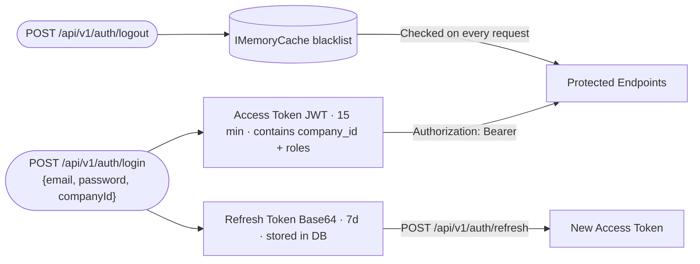

**Access Token** - Short-lived JWT (15 min). Carries `sub` (UserID), `email`, `fullname`, `company_id`, and `roles` as claims. Sent as `Authorization: Bearer <token>`. Call `GET /api/v1/auth/me` after login to retrieve the full permission set; the frontend should store this in app state (Redux/Zustand/Pinia) and re-fetch on each token refresh.

**Refresh Token** - Long-lived Base64 token (7d). Stored in PostgreSQL with SHA256 hash. Used to obtain a new access token without re-authentication. Revoked tokens are tracked in database.

Access-token revocation markers are stored in process-local `IMemoryCache` until the token's normal expiry. Restarting the API clears those markers; a revoked access token may therefore be usable until its normal 15-minute expiry after a restart. Refresh-token rotation and revocation remain durable in PostgreSQL.

### Token Lifecycle Examples

```bash
# Step 1: Get available companies (public endpoint)
curl http://localhost:8080/api/v1/companies/public

# Response
{
  "success": true,
  "data": [
    { "id": 1, "code": "DEFAULT", "name": "Default Company" }
  ]
}

# Step 2: Login with company selection
curl -X POST http://localhost:8080/api/v1/auth/login \
  -H "Content-Type: application/json" \
  -d '{"email":"admin@example.com","password":"Admin123!","companyId":1}'

# Response
{
  "success": true,
  "data": {
    "accessToken": "eyJhbGciOiJIUzI1NiIs...",
    "refreshToken": "a1b2c3d4e5f6...",
    "expiresIn": 900
  },
  "message": "Login successful"
}

# Get current user
curl http://localhost:8080/api/v1/auth/me \
  -H "Authorization: Bearer <access_token>"

# Refresh
curl -X POST http://localhost:8080/api/v1/auth/refresh \
  -H "Content-Type: application/json" \
  -d '{"refreshToken":"<refresh_token>"}'

# Logout (revokes both tokens)
curl -X POST http://localhost:8080/api/v1/auth/logout \
  -H "Authorization: Bearer <access_token>" \
  -H "Content-Type: application/json" \
  -d '{"refreshToken":"<refresh_token>"}'
```

---

## RBAC System

### Permission Format

All permissions follow the pattern: **`{module}.{resource}.{action}`**

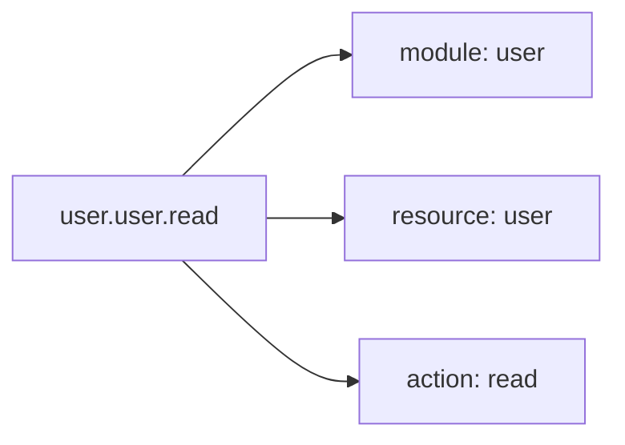

**Modules:** `approval` · `audit` · `budget` · `rca` · `report` · `system` · `user` · `workflow` · `workorder`

**Resources:** `activity_type` · `ap` · `company` · `dashboard` · `finance-report` · `item` · `log` · `permission` · `plan` · `po` · `rate_card` · `recap` · `report` · `role` · `self` · `sync` · `tax_type` · `template` · `uom` · `user` · `vendor` · `warehouse` · `workorder`

**Actions:** `approve` · `assign` · `create` · `delete` · `execute` · `export` · `generate` · `read` · `reject` · `reset_password` · `submit` · `update`

### Wildcard Permissions

WAMS supports **wildcard permissions** for flexible access control. Wildcards allow a single permission to match multiple resources or actions.

| Wildcard Pattern | Description | Example Match |
|------------------|-------------|---------------|
| `*.*.*` | Full system access (Super Admin) | Matches ALL permissions |
| `*.*.read` | Read-only access to everything | `user.user.read`, `budget.budget.read`, etc. |
| `module.*.*` | All actions on all resources in a module | `workorder.*.*` matches all workorder permissions |
| `module.resource.*` | All actions on a specific resource | `budget.plan.*` matches create, read, update, approve, reject |
| `module.*.action` | Specific action on all resources in a module | `workorder.*.read` matches `workorder.workorder.read`, `workorder.recap.read` |
| `*.resource.action` | Specific action on a resource across all modules | `*.dashboard.read` matches dashboard read from any module |

#### Wildcard Matching Logic

The permission check in [`RbacService.HasPermissionAsync()`](src/WAMS.Application/Services/RbacService.cs:28) evaluates in this order:

1. **Full wildcard**: `*.*.*` → always matches
2. **Global action wildcard**: `*.*.action` → matches if actions equal
3. **Module wildcard**: `module.*.*` → matches if modules equal
4. **Resource wildcard**: `module.resource.*` → matches if module and resource equal
5. **Module action wildcard**: `module.*.action` → matches if module and action equal
6. **Cross-module resource**: `*.resource.action` → matches if resource and action equal
7. **Exact match**: `module.resource.action` → all three must match

### User-Level Permission Overrides

Beyond role-based permissions, WAMS supports **user-level overrides** that can grant or deny individual permissions per user - independent of their roles. This enables scenarios like:

- *"Budi is a FOREMAN but needs temporary advance approval rights for 2 weeks"* → user-level **grant**
- *"Sari should NOT close work orders, even though her WAREHOUSE_HEAD role allows it"* → user-level **deny**

#### Resolution Order

| Priority | Source | Effect |
|----------|--------|--------|
| 1 (highest) | **User-level DENY** | Always overrides - even wildcard role grants |
| 2 | **User-level GRANT** | Adds permissions beyond the user's roles |
| 3 | **Role-based permissions** | Standard wildcard matching |
| 4 (default) | **No match** | 403 Forbidden |

Overrides can be **permanent** (no expiry) or **temporary** (via `ExpiresAt`). Expired overrides are automatically ignored. Both `user_permissions` and `role_permissions` support an optional **`constraints`** JSON field, reserved for future data-level enforcement (e.g. `{"max_approval_amount": 500000000}`).

#### User Permission API

```bash
# List all active overrides for a user
GET /api/v1/users/{id}/permissions

# Grant an extra permission (beyond roles)
POST /api/v1/users/{id}/permissions/{permissionId}/grant
{ "expiresAt": "2026-03-15T00:00:00Z", "reason": "Covering for Ibu Sari during leave" }

# Explicitly deny a permission (overrides role grants)
POST /api/v1/users/{id}/permissions/{permissionId}/deny
{ "reason": "Restricted per management request" }

# Remove an override (reverts to role default)
DELETE /api/v1/users/{id}/permissions/{permissionId}

# Get resolved view: all permissions with their source
GET /api/v1/users/{id}/permissions/effective
```

**Sample `/effective` response:**

```json
{
  "data": [
    { "permissionId": 12, "permission": "budget.plan.approve", "granted": true,  "source": "role",       "roleName": "WAREHOUSE_HEAD", "reason": null,                          "expiresAt": null },
    { "permissionId": 9,  "permission": "workorder.workorder.delete", "granted": false, "source": "user_deny", "roleName": null,             "reason": "Restricted per management",   "expiresAt": "2026-03-15T00:00:00Z" },
    { "permissionId": 21, "permission": "budget.plan.approve",     "granted": true, "source": "user_grant", "roleName": null,             "reason": "Covering for Ibu Sari",       "expiresAt": "2026-03-10T00:00:00Z" }
  ]
}
```

### Default Roles

| Role | Description | System | Global Access | Permissions |
|------|-------------|:------:|:-------------:|-------------|
| `SUPER_ADMIN` | Full system access with all permissions | ✓ | ✓ | `*.*.*` (wildcard) |
| `HO_SPV` | Head Office Admin - HO-level management and oversight | ✓ | ✓ | `budget.*.*`, `report.*.*`, `user.*.read`, `workorder.*.read`, `workflow.*.*` |
| `WAREHOUSE_HEAD` | Head of Warehouse - Stage 1 approver for budget plans | ✗ | ✗ | `budget.plan.{read,approve,reject}`, `budget.template.read`, `workorder.*.read`, `workflow.template.read` |
| `COORDINATOR_WH` | Coordinator of Warehouse - Stage 2 approver for budget plans | ✗ | ✗ | `budget.plan.{read,approve,reject}`, `budget.template.read`, `workorder.*.read`, `budget.{vendor,item,uom,rate_card}.read`, `budget.po.read`, `workflow.template.read` |
| `WAREHOUSE_ADMIN` | Warehouse Admin - manages daily warehouse operations | ✗ | ✗ | `user.warehouse.read`, `budget.plan.{create,read,update,submit,delete}`, `budget.{rate_card,uom,template,item,vendor}.read`, `budget.po.*`, `workorder.*.*`, `report.*.read`, `workflow.template.read` |
| `FINANCE_USER` | Finance User - handles payments and reports | ✗ | ✓ | `report.dashboard.read`, `report.finance-report.read`, `budget.plan.read`, `budget.template.read`, `budget.{vendor,item,rate_card}.read` |
| `FOREMAN` | Foreman - data entry in the field | ✗ | ✗ | `workorder.workorder.{read,update,delete,submit,execute}` |
| `VIEWER` | Viewer / Management - read-only access across the system | ✓ | ✓ | `*.*.read` (wildcard) |

> **System roles** (`IsSystem: true`) are protected and cannot be deleted.
> **Global access** (`GlobalAccess: true`) grants access across all warehouses without explicit assignment.
> **WAREHOUSE_HEAD** is warehouse-scoped (`GlobalAccess: false`) - they approve budgets for their assigned warehouses only.

### All Seeded Permissions

| Module | Resource | Action | Description |
|--------|----------|--------|-------------|
| `user` | `user` | `create` | Create new users |
| `user` | `user` | `read` | View user details |
| `user` | `user` | `update` | Update user information |
| `user` | `user` | `reset_password` | Reset another user's password |
| `user` | `user` | `delete` | Delete users |
| `user` | `role` | `create` | Create new roles |
| `user` | `role` | `read` | View role details |
| `user` | `role` | `update` | Update role information |
| `user` | `role` | `delete` | Delete roles |
| `user` | `permission` | `create` | Grant or deny user-level permission overrides |
| `user` | `permission` | `read` | View permissions and effective permission list |
| `user` | `permission` | `delete` | Remove user-level permission overrides |
| `user` | `warehouse` | `create` | Assign warehouses to users |
| `user` | `warehouse` | `read` | View warehouses |
| `user` | `warehouse` | `delete` | Remove warehouse assignments from users |
| `budget` | `template` | `create` | Create budget templates (HO SPV) |
| `budget` | `template` | `read` | View budget templates |
| `budget` | `template` | `update` | Update budget templates |
| `budget` | `template` | `delete` | Delete budget templates |
| `budget` | `template` | `submit` | Submit budget template for approval |
| `budget` | `template` | `approve` | Approve budget templates (Warehouse Head) |
| `budget` | `template` | `reject` | Reject budget templates (Warehouse Head) |
| `budget` | `plan` | `create` | Create budget plans (Warehouse Admin) |
| `budget` | `plan` | `read` | View budget plans |
| `budget` | `plan` | `update` | Update budget plans |
| `budget` | `plan` | `submit` | Submit budget plan for approval |
| `budget` | `plan` | `approve` | Approve budget plans |
| `budget` | `plan` | `reject` | Reject budget plans |
| `budget` | `plan` | `delete` | Delete budget plans (drafts only) |
| `budget` | `rate_card` | `create` | Manage rate cards |
| `budget` | `rate_card` | `read` | View rate cards |
| `budget` | `rate_card` | `update` | Update draft rate cards |
| `budget` | `rate_card` | `submit` | Submit draft rate cards |
| `budget` | `rate_card` | `delete` | Soft-delete draft rate cards |
| `budget` | `tax_type` | `read` | View tax rate reference entries (SAP-synced, read-only) |
| `workorder` | `workorder` | `read` | View work orders and their realization data |
| `workorder` | `workorder` | `update` | Record work order realization - field data entry, fumigation, QC/moisture |
| `workorder` | `workorder` | `delete` | Delete draft work orders |
| `workorder` | `workorder` | `submit` | Submit work orders for recap |
| `workorder` | `workorder` | `execute` | Can be assigned as work order PIC - tick this for field roles (Foreman and equivalents) |
| `report` | `dashboard` | `read` | View dashboard KPIs |
| `report` | `finance-report` | `read` | View finance reports |
| `approval` | `self` | `approve` | Approve a budget plan you submitted yourself (bypasses segregation of duties) |
| `system` | `company` | `create` | Create companies |
| `system` | `company` | `read` | View all companies |
| `system` | `company` | `update` | Update companies |
| `system` | `company` | `delete` | Deactivate companies |
| `system` | `company` | `assign` | Assign users to companies |
| `system` | `sync` | `execute` | Trigger manual master data sync from ERP |
| `system` | `sync` | `read` | View sync run history and health status |
| `system` | `activity_type` | `create` | Create activity types |
| `system` | `activity_type` | `update` | Update activity types |
| `system` | `activity_type` | `delete` | Delete activity types |
| `*` | `*` | `*` | Full system access (Super Admin) |
| `*` | `*` | `read` | Read-only access to everything (Viewer) |

### Applying Permissions in Controllers

```csharp
// Declarative permission enforcement via attribute
[HttpGet]
[RequirePermission("user", "user", "read")]
public async Task<IActionResult> GetAll()
{
    // Only users with user.user.read permission can access
}

// Multiple permissions (OR logic - any matches)
[HttpPost("{id:int}/roles/{roleId:int}")]
[RequirePermission("user", "role", "create")]
public async Task<IActionResult> AssignRole(int id, int roleId)
{
    // Requires user.role.create permission
}
```

### Role Management API

```bash
# List all roles
curl http://localhost:8080/api/v1/roles \
  -H "Authorization: Bearer <token>"

# Create a custom role
curl -X POST http://localhost:8080/api/v1/roles \
  -H "Authorization: Bearer <token>" \
  -H "Content-Type: application/json" \
  -d '{"name":"MANAGER","displayName":"Manager","description":"Department manager"}'

# Grant a permission to a role
curl -X POST http://localhost:8080/api/v1/roles/<role-id>/permissions/<permission-id> \
  -H "Authorization: Bearer <token>"
```

---

## Database Schema

```mermaid
erDiagram
    companies {
        bigint id PK
        string code UK
        string name
        string address
        string phone
        string email
        bool is_active
        timestamp created_at
        timestamp updated_at
    }

    users {
        bigint id PK
        bigint company_id FK
        string email UK
        string password_hash
        string fullname
        string employee_id
        bool is_active
        timestamp deleted_at
        bigint created_by FK
        timestamp created_at
        timestamp updated_at
    }

    roles {
        bigint id PK
        bigint company_id FK
        string name UK
        string display_name
        string description
        bool is_system
        bool global_access
        timestamp created_at
        timestamp updated_at
    }

    permissions {
        bigint id PK
        string module
        string resource
        string action
        string description
        timestamp created_at
    }

    user_roles {
        bigint user_id FK
        bigint role_id FK
        timestamp created_at
    }

    role_permissions {
        bigint role_id FK
        bigint permission_id FK
        bigint granted_by FK
        timestamp granted_at
        jsonb constraints
    }

    user_permissions {
        bigint user_id FK
        bigint permission_id FK
        bool is_granted
        bigint granted_by FK
        timestamp granted_at
        timestamp expires_at
        string reason
        jsonb constraints
    }

    user_warehouses {
        bigint user_id FK
        bigint warehouse_id FK
        bool is_primary
        timestamp created_at
    }

    warehouses {
        bigint id PK
        bigint company_id FK
        string code
        string name
        string location
        bool is_active
        timestamp first_seen_at
        timestamp synced_at
    }

    refresh_tokens {
        bigint id PK
        bigint user_id FK
        string token_hash UK
        string device_info
        string ip_address
        timestamp expires_at
        timestamp revoked_at
        timestamp created_at
    }

    rate_cards {
        bigint id PK
        bigint company_id FK
        bigint vendor_shadow_id FK
        int status
        bigint created_by_user_id FK
        timestamp submitted_at
        timestamp deleted_at
        timestamp created_at
        timestamp updated_at
    }

    rate_card_items {
        bigint id PK
        bigint rate_card_id FK
        bigint item_shadow_id FK
        bigint uom_master_id FK
        decimal cost_value
        bigint ppn_tax_type_id "nullable, no live FK - snapshotted id, null = no PPN"
        string ppn_tax_type_code "nullable, snapshot of tax_types.code at selection time"
        decimal ppn_rate "nullable, snapshot of tax_types.rate at selection time"
        bigint pph_tax_type_id "nullable, no live FK - snapshotted id, null = no PPh"
        string pph_tax_type_code "nullable, snapshot of tax_types.code at selection time"
        decimal pph_rate "nullable, snapshot of tax_types.rate at selection time"
        string cost_treatment "nullable, Dibiayakan or TidakDibiayakan, label only"
        timestamp created_at
        timestamp updated_at
    }

    tax_types {
        bigint id PK
        string category "Ppn or Pph"
        string code UK "e.g. PPN11, PPH23"
        string name
        decimal rate "percentage, e.g. 11.00"
        bool is_active
        timestamp created_at
        timestamp updated_at
    }

    activity_types {
        bigint id PK
        string code UK
        string name
        bool is_active
        timestamp deleted_at
        timestamp created_at
        timestamp updated_at
    }

    budget_templates {
        bigint id PK
        string code UK
        bigint company_id FK
        bigint province_id FK "nullable"
        int status
        bigint created_by_user_id FK
        bigint submitted_by_user_id FK
        timestamp submitted_at
        timestamp deleted_at
        timestamp created_at
        timestamp updated_at
    }

    budget_template_items {
        bigint id PK
        bigint budget_template_id FK
        bigint item_shadow_id FK
        bigint activity_type_id FK "required, per-item activity type"
        int sort_order
        timestamp created_at
        timestamp updated_at
    }

    companies ||--o{ users : "employs"
    companies ||--o{ warehouses : "owns"
    companies ||--o{ roles : "has custom"
    companies ||--o{ rate_cards : "has"
    companies ||--o{ budget_templates : "has"
    users ||--o{ user_roles : "assigned"
    roles ||--o{ user_roles : "assigned to"
    roles ||--o{ role_permissions : "has"
    permissions ||--o{ role_permissions : "granted via"
    users ||--o{ user_permissions : "overrides"
    permissions ||--o{ user_permissions : "overridden by"
    users ||--o{ user_warehouses : "belongs to"
    warehouses ||--o{ user_warehouses : "contains"
    users ||--o{ refresh_tokens : "owns"
    users ||--o{ rate_cards : "creates"
    vendor_shadows ||--o{ rate_cards : "priced for"
    rate_cards ||--o{ rate_card_items : "contains"
    item_shadows ||--o{ rate_card_items : "priced as"
    uom_masters ||--o{ rate_card_items : "measured in"
    activity_types ||--o{ budget_template_items : "categorizes"
    users ||--o{ budget_templates : "creates"
    budget_templates ||--o{ budget_template_items : "contains"
    item_shadows ||--o{ budget_template_items : "referenced by"
    warehouses ||--o{ budget_plans : "assigned to"
    budget_plan_items ||--o{ work_orders : "has one WO"
```

### Table Glossary

| Table | Purpose | Key Features |
|-------|---------|--------------|
| `companies` | Tenant entity for multi-tenancy | Unique `code`; `is_active` for soft deactivation |
| `users` | Core user entity with credentials and profile | Soft delete via `deleted_at`; unique email excludes deleted users; belongs to company |
| `roles` | Role definitions | `is_system` marks protected roles; `global_access` for warehouse-wide access; `company_id` null for system roles |
| `permissions` | All possible `module.resource.action` combinations | Composite unique key on (module, resource, action) |
| `role_permissions` | Many-to-many: which permissions a role grants | Tracks `granted_by`, `granted_at`, optional `constraints` jsonb |
| `user_permissions` | User-level permission overrides (grant or deny) | `is_granted` flag; optional `expires_at` for temporary overrides; `constraints` jsonb for future limit enforcement |
| `user_roles` | Many-to-many: which roles a user has | Simple junction table |
| `user_warehouses` | Many-to-many: user↔warehouse assignment | One `is_primary` per user |
| `warehouse_shadows` | ERP shadow table - warehouse master data synced from external ERP | Unique `(company_id, code)` index; `is_active` for soft-deactivation when missing from ERP; `first_seen_at` / `synced_at` for audit trail; never hard-deleted to preserve `user_warehouses` FK references |
| `vendor_shadows` | ERP shadow table - vendor master data synced from external ERP | Unique `(company_id, card_code)` index; `is_active` soft-deactivation; `first_seen_at` / `synced_at` for audit trail |
| `item_shadows` | ERP shadow table - item/cost-item master data synced from external ERP | Unique `(company_id, item_code)` index; `is_active` soft-deactivation; `first_seen_at` / `synced_at` for audit trail |
| `uom_masters` | Unit of measure master data | `code` + `name`; `is_active` flag; soft delete via `deleted_at`; global (no tenant filter) |
| `rate_cards` | Rate card header - vendor-specific pricing document | Scoped to company; `status` (Draft/Submitted); soft delete via `deleted_at`; FK to `vendor_shadows` and `users` |
| `rate_card_items` | Rate card line items - item pricing per UoM | FK to `rate_cards` (cascade delete), `item_shadows`, `uom_masters`; `cost_value` numeric(18,2); nullable `ppn_tax_type_id`/`pph_tax_type_id` are a plain snapshotted id with **no live FK** to `tax_types` - `null` means "no tax" (the default), a value means the user opted this line into that tax; nullable `ppn_tax_type_code`/`pph_tax_type_code` and `ppn_rate`/`pph_rate` snapshot `tax_types.code`/`rate` at selection time so editing (or deactivating) the master tax type later doesn't retroactively change an already-saved line (see [Tax Calculation](#tax-calculation-ppn--pph)); nullable `cost_treatment` (`Dibiayakan`/`TidakDibiayakan`) is a label-only accounting tag with no effect on `cost_value` or any tax amount |
| `tax_types` | Tax rate reference master - one row per PPN/PPh rate the company recognizes | No `CompanyId` - national tax rates, shared across all tenants; `category` (Ppn/Pph); unique `code`; `rate` is a percentage (e.g. `11.00` = 11%), not a fraction; `is_active` for soft-deactivation - existing selections keep working, only removed from new-selection dropdowns; seeded with `PPN0` (0%), `PPN11` (11%), `PPH22` (1.5%), `PPH23` (2%) |
| `activity_types` | Global master for template activity categories | No `CompanyId` - shared across all tenants; unique `code`; soft delete via `deleted_at`; seeded with 4 defaults |
| `budget_templates` | Budget template header - province-scoped cost structure | Tenant-scoped (company-wide, no warehouse FK); nullable `province_id` FK to `provinces`; auto-generated `code` (`T.{YYMM}{seq}`, e.g. `T.260400001`); `status` (Draft/Submitted); soft delete |
| `budget_template_items` | Budget template line items - references to `item_shadows` | FK to `budget_templates` (cascade delete); required `activity_type_id` FK - activity type is set per item, not per template; `sort_order` preserves item ordering; cost details joined from `item_shadows` at query time |
| `budget_plans` | Budget plan header - period cost document created from an approved template | Tenant-scoped; direct FK to `warehouse_shadows` (`warehouse_shadow_id`) - warehouse is chosen at BP creation and must match the template's `province_id`; auto-generated `code` (`BP.{YYMM}{6-digit-seq}`); `status` (Draft/Submitted/InApproval/Approved/Rejected); rejection fields; soft delete |
| `workflow_templates` | Approval matrix definition per company and document type | Scoped to company; one active template per `(company_id, doc_type)` at a time; `doc_type` is code-defined (e.g. `BudgetPlanApproval`) |
| `workflow_stages` | Ordered stage definitions belonging to a template | `stage_order` (unique per template), `stage_name`, `approver_roles` (text[]); full replacement on template update |
| `workflow_instances` | Snapshot of a workflow template created when a document is submitted | Tied to a specific `doc_id` + `doc_type`; `current_stage_order` tracks active stage; unaffected by later template edits |
| `workflow_instance_stages` | Per-stage audit record for an in-flight or completed workflow | Copied from `workflow_stages` at submission time; `status` (Pending/Approved/Rejected); stores `approved_by_user_id`, `approved_at`, `rejected_by_user_id`, `rejected_at`, `rejection_reason`; optimistic concurrency via PostgreSQL `xmin` |
| `budget_plan_items` | Budget plan line items - vendor + item + snapshotted price + quantity | FK to `budget_plans` (cascade delete), `item_shadows`, `vendor_shadows`, `uom_masters`; `cost_value` and `total_value` stored as numeric(18,2); `quantity` as numeric(18,4); `uom_master_id` defaults to the rate-card UoM but can be overridden per item at creation/update time; carries a frozen PPN/PPh tax snapshot (`ppn_tax_type_code`, `ppn_rate`, `pph_tax_type_code`, `pph_rate`, `ppn_amount`, `pph_amount`, `grand_total`) computed from the rate card item's tax selection at the moment this line was created - see [Tax Calculation](#tax-calculation-ppn--pph); also carries `cost_treatment`, copied verbatim from the source rate card item - label only, no effect on any of the amounts above |
| `work_orders` | Work order header | Tenant-scoped; auto-generated `code` (`WO.{YYMM}{seq}`); soft delete via `deleted_at`; FK to `budget_plan_items` (`budget_plan_item_id`) linking each WO to a specific activity line; GPS stored as 4 flat columns (`gps_latitude numeric(10,7)`, `gps_longitude numeric(11,7)`, `gps_accuracy numeric(8,2)`, `gps_recorded_at timestamptz`) with a DB check constraint `chk_work_orders_gps_coherence` enforcing all-null or all-non-null; mapped as `GpsCoordinate` owned entity in EF Core |
| `refresh_tokens` | Persisted refresh tokens with revocation tracking | Indexed by token_hash for fast lookup |
| `sync_logs` | Audit record for every ERP sync run (one row per company per service invocation) | Stores `service_name`, `company_code`, `started_at`, `finished_at`, `outcome` (enum as string), row counts (`added`, `updated`, `deactivated`), and `abort_reason` when failed; indexed on `(service_name, started_at)` and `(outcome, service_name, finished_at)` for stale detection queries |

### Auto-Increment Primary Keys

All primary keys in WAMS use **auto-increment integers** (serial type in PostgreSQL). This provides several benefits:

- **Simplicity**: Easy to understand and work with
- **Performance**: Smaller index size compared to UUIDs
- **Human-readable**: IDs are sequential numbers that are easy to reference

```csharp
// BaseEntity uses auto-increment Id
public abstract class BaseEntity
{
    public int Id { get; set; }
    public DateTime CreatedAt { get; set; } = DateTime.UtcNow;
    public DateTime? UpdatedAt { get; set; }
}
```

> **Note**: The database auto-generates IDs via serial columns. EF Core configurations use `UseSerialColumn()` for PostgreSQL.

---

## Audit Logging

Two write paths feed the `audit_log` table. The EF Core `ChangeTracker` interceptor writes one row per entity change automatically on every `SaveChangesAsync`. Services that record business events without changing tracked data inject `IAuditLogWriter` and call `LogAsync` directly.

### Architecture

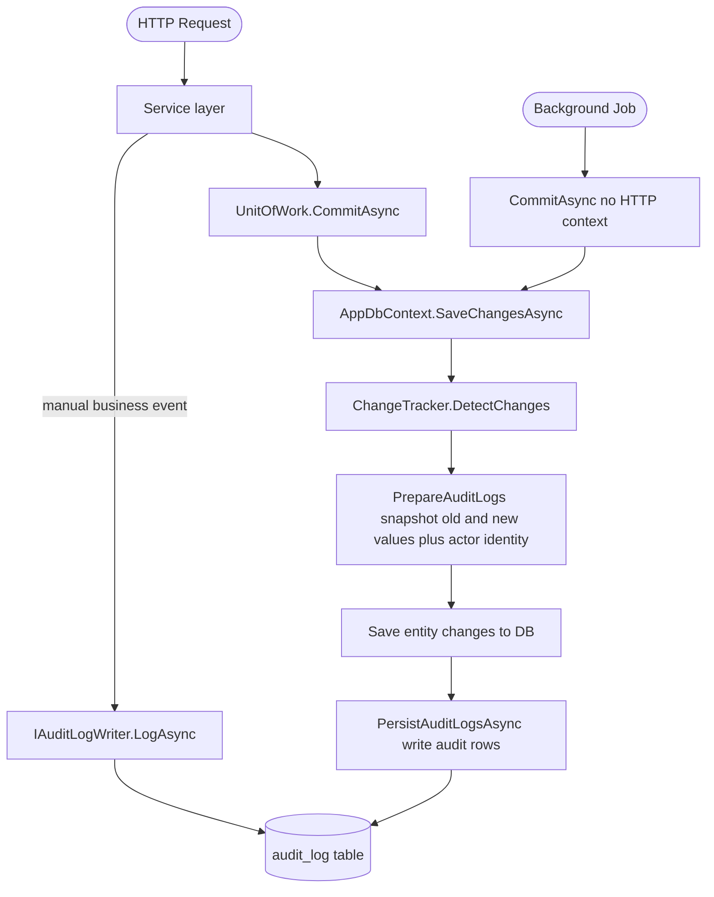

### Path 1: Automatic (ChangeTracker Interceptor)

`AppDbContext.SaveChangesAsync` calls `PrepareAuditLogs` before writing changes. This method walks `ChangeTracker.Entries`, snapshots old and new property values, reads the actor identity from the JWT `sub` / `email` / `fullname` claims via `IHttpContextAccessor`, and builds one `AuditLog` entity per changed row. After the main transaction commits, `PersistAuditLogsAsync` writes the audit rows.

Most entities use this path. The interceptor skips entity types listed in `_auditExcludedTypes` and never writes property names in `AuditExcludedProperties` (`PasswordHash`, `TokenHash`) to `old_values` or `new_values`.

### Path 2: Manual (IAuditLogWriter)

Operations that do not save tracked entities, or that need a single consolidated audit row across multiple child tables, inject `IAuditLogWriter` and call `LogAsync` with full control over all fields:

```csharp
await _auditLogWriter.LogAsync(
    action: "LOGIN",
    tableName: "users",
    recordId: user.Id,
    userId: user.Id,
    userEmail: user.Email,
    userFullname: user.Fullname,
    companyId: actingCompanyId,
    ipAddress: ipAddress,
    oldValues: null,
    newValues: null,
    ct: ct);
```

Services that use Path 2: **`AuthService`** (Login), **`WorkOrderService`** (Create, Update, Submit, Delete).

### What Is Captured

| Field | Source | Notes |
|---|---|---|
| `user_id` | JWT `sub` claim | Null for system operations |
| `user_email` | JWT `email` claim | Snapshotted; survives user deletion |
| `user_fullname` | JWT `fullname` claim | Snapshotted; survives user deletion |
| `company_id` | Entity property → navigation → JWT claim | Correct even for junction tables and Super Admin |
| `action` | EF entry state (`CREATE` / `UPDATE` / `DELETE`) or caller | Up to 50 chars, code-defined |
| `table_name` | EF metadata | Snake_case table name |
| `record_id` | PK value (single integer PK only) | Populated after save for CREATEs |
| `record_key` | JSON of all PK properties | Used for composite-PK junction tables (e.g. `UserRole`) |
| `old_values` | JSONB snapshot before change | Full snapshot for sensitive tables; diff-only for others |
| `new_values` | JSONB snapshot after change | Full snapshot for sensitive tables; diff-only for others |
| `request_id` | `RequestIdMiddleware` | Distributed trace correlation |
| `request_path` | `HttpContext.Request.Path` | `[SYSTEM]` for background operations |
| `http_method` | `HttpContext.Request.Method` | `SYSTEM` for background operations |
| `ip_address` | `X-Forwarded-For` → `RemoteIpAddress` | Reverse-proxy aware |
| `user_agent` | `User-Agent` header | Browser / app client identification |
| `created_at` | `DateTime.UtcNow` | No `updated_at`; records are immutable |

### Excluded Entities

These entity groups are excluded from the automatic interceptor to prevent log noise. They either change at high frequency, already constitute their own structured log, or their change history sits in the parent audit row.

| Excluded Table(s) | Reason |
|---|---|
| `notifications` | High-frequency system events with no user attribution value |
| `sync_logs` | Already a structured event log; auditing it recursively adds no information |
| `file_attachments` | Low-stakes metadata changes; upload / delete intent is clear from the request |
| `work_order_unloading_items`, `work_order_loading_items`, `work_order_transport_orders`, and all other WO child tables | Child state is embedded in the parent WO audit snapshot (see Work Order Auditing) |

Add types to `_auditExcludedTypes` in `AppDbContext` to exclude more.

### Full Snapshot vs. Diff-Only

For UPDATE operations, the content of `old_values` depends on the entity:

| Mode | Tables | `old_values` content |
|---|---|---|
| **Full snapshot** | `users`, `roles`, `permissions`, `budget_plans` | All fields before the change |
| **Diff-only** (default) | All other tables | Only changed fields + PK |

Full snapshot enables point-in-time record reconstruction. Add a table name to `FullSnapshotTables` in `AppDbContext` to opt a table in.

### Work Order Auditing

Work orders use Path 2 exclusively. The interceptor excludes the WO header and all child tables (`work_order_unloading_items`, `work_order_loading_items`, `work_order_fumigation_details`, etc.) to prevent one user action from generating dozens of audit rows.

`WorkOrderService` writes one audit row per operation:

| Operation | `action` | `old_values` | `new_values` |
|---|---|---|---|
| Create | `CREATE` | null | Full WO header fields + child arrays embedded as JSON (via `BuildCreateSnapshot`) |
| Update (child collections changed) | `UPDATE` | Previous child arrays snapshot | New child arrays snapshot (via `BuildChildSnapshot`) |
| Update (scalar fields only, no child changes) | - | - | No audit row written |
| Submit | `UPDATE` | `{Status: "Draft"}` | `{Status: "Submitted", SubmittedAt}` |
| Delete | `DELETE` | `{Id, Code, Status, BudgetPlanId}` | null |

`BuildChildSnapshot` serializes the active child item arrays (UnloadingItems, LoadingItems, etc.) into a single JSON object. `UpdateAsync` compares the old and new child snapshots as strings before deciding to write a row, so scalar-only edits produce no noise in the log.

### System Operations

Background jobs (ERP sync, seeder, reminders) call `CommitAsync` without an HTTP context. The interceptor detects the missing context and writes:
- `user_email = "system@internal"`, `user_fullname = "System"`
- `request_path = "[SYSTEM]"`, `http_method = "SYSTEM"`
- `user_id`, `ip_address`, `user_agent` = null

### Sensitive Fields

The interceptor never writes these property names to `old_values` or `new_values`:
- `PasswordHash`
- `TokenHash`

Add names to `AuditExcludedProperties` in `AppDbContext` to exclude more.

### Tenant Isolation

`AuditLogRepository` scopes reads by `company_id` via `ITenantContext`. Regular users see only their company's logs. Super Admin sees all logs and can filter by `companyId` query parameter.

### Schema

```sql
audit_log
├── id               BIGSERIAL PRIMARY KEY
├── user_id          BIGINT NULL
├── user_email       VARCHAR(255) NULL
├── user_fullname    VARCHAR(255) NULL
├── company_id       BIGINT NULL
├── action           VARCHAR(50) NOT NULL
├── table_name       VARCHAR(128) NOT NULL
├── record_id        BIGINT NULL                  -- single-PK entities
├── record_key       VARCHAR(255) NULL            -- composite-PK entities (JSON)
├── old_values       JSONB NULL
├── new_values       JSONB NULL
├── request_id       VARCHAR(100) NULL
├── request_path     VARCHAR(255) NULL
├── http_method      VARCHAR(10) NULL
├── ip_address       VARCHAR(45) NULL             -- supports IPv6
├── user_agent       VARCHAR(512) NULL
└── created_at       TIMESTAMP WITH TIME ZONE NOT NULL

-- Indexes
idx_audit_log_user_id         ON (user_id)
idx_audit_log_company_id      ON (company_id)
idx_audit_log_created_at      ON (created_at)
idx_audit_log_table_name      ON (table_name)
idx_audit_log_record_id       ON (record_id)
idx_audit_log_company_created ON (company_id, created_at)   ← primary query pattern
```

### Logged Operations Reference

Each row in `audit_log` corresponds to one operation below. Use this table to look up what `action`, `table_name`, `record_id`/`record_key`, and `old_values`/`new_values` contain for any user action.

| User / System Operation | `table_name` | `action` | `record_id` | `record_key` | `old_values` | `new_values` | Snapshot mode |
|---|---|---|---|---|---|---|---|
| Create user | `users` | `CREATE` | new user ID | - | null | full new record | Full |
| Update user profile / deactivate | `users` | `UPDATE` | user ID | - | full record before | full record after | Full |
| Soft-delete user (`deleted_at` set) | `users` | `DELETE` | user ID | - | full record before | null | Full |
| Change own password (`POST /auth/change-password`) | `users` | `UPDATE` then `CHANGE_PASSWORD` | user ID | - | full record before / null | full record after (`PasswordHash` excluded) / null | Full, then explicit action row (two rows written; see below) |
| Admin reset password (`POST /users/{id}/password`) | `users` | `UPDATE` then `RESET_PASSWORD` | target user ID | - | full record before / null | full record after (`PasswordHash` excluded) / null | Full, then explicit action row (two rows written; see below) |
| Assign role to user | `user_roles` | `CREATE` | null | `{"UserId":N,"RoleId":M}` | null | `{UserId, RoleId, CreatedAt}` | Diff |
| Remove role from user | `user_roles` | `DELETE` | null | `{"UserId":N,"RoleId":M}` | `{UserId, RoleId, CreatedAt}` | null | Diff |
| Assign warehouse to user | `user_warehouses` | `CREATE` | null | `{"UserId":N,"WarehouseShadowId":M}` | null | `{UserId, WarehouseId, IsPrimary, CreatedAt}` | Diff |
| Remove warehouse from user | `user_warehouses` | `DELETE` | null | `{"UserId":N,"WarehouseShadowId":M}` | `{UserId, WarehouseId, IsPrimary, CreatedAt}` | null | Diff |
| Grant/deny user permission override | `user_permissions` | `CREATE` | new record ID | - | null | `{UserId, PermissionId, IsGranted, ExpiresAt, ...}` | Diff |
| Remove user permission override | `user_permissions` | `DELETE` | record ID | - | `{UserId, PermissionId, IsGranted, ...}` | null | Diff |
| Create role | `roles` | `CREATE` | new role ID | - | null | full new record | Full |
| Update role | `roles` | `UPDATE` | role ID | - | full record before | full record after | Full |
| Delete role | `roles` | `DELETE` | role ID | - | full record before | null | Full |
| Assign permission to role | `role_permissions` | `CREATE` | null | `{"RoleId":N,"PermissionId":M}` | null | `{RoleId, PermissionId, GrantedBy, GrantedAt}` | Diff |
| Remove permission from role | `role_permissions` | `DELETE` | null | `{"RoleId":N,"PermissionId":M}` | `{RoleId, PermissionId, GrantedBy, GrantedAt}` | null | Diff |
| Create company | `companies` | `CREATE` | new company ID | - | null | full new record | Diff |
| Update company | `companies` | `UPDATE` | company ID | - | changed fields | changed fields | Diff |
| Deactivate company | `companies` | `UPDATE` | company ID | - | `{Id, IsActive: true}` | `{Id, IsActive: false}` | Diff |
| Create rate card | `rate_cards` | `CREATE` | new rate card ID | - | null | full new record | Diff |
| Submit rate card | `rate_cards` | `UPDATE` | rate card ID | - | `{Id, Status: 0}` | `{Id, Status: 1, SubmittedAt}` | Diff |
| Delete rate card | `rate_cards` | `UPDATE` | rate card ID | - | `{Id, DeletedAt: null}` | `{Id, DeletedAt: timestamp}` | Diff |
| Create budget template | `budget_templates` | `CREATE` | new template ID | - | null | full new record | Diff |
| Submit budget template | `budget_templates` | `UPDATE` | template ID | - | `{Id, Status: 0}` | `{Id, Status: 1, SubmittedAt}` | Diff |
| Approve budget template | `budget_templates` | `UPDATE` | template ID | - | `{Id, Status: 1}` | `{Id, Status: 2, ApprovedAt}` | Diff |
| Create budget plan | `budget_plans` | `CREATE` | new plan ID | - | null | full new record | Full |
| Update budget plan | `budget_plans` | `UPDATE` | plan ID | - | full record before | full record after | Full |
| Submit budget plan | `budget_plans` | `UPDATE` | plan ID | - | full record before | full record after | Full |
| Approve budget plan | `budget_plans` | `UPDATE` | plan ID | - | full record before | full record after | Full |
| Reject budget plan | `budget_plans` | `UPDATE` | plan ID | - | full record before | full record after | Full |
| Soft-delete budget plan | `budget_plans` | `DELETE` | plan ID | - | full record before | null | Full |
| Create work order | `work_orders` | `CREATE` | new WO ID | - | null | WO header + child arrays JSON (manual) | Manual |
| Update work order (child collections changed) | `work_orders` | `UPDATE` | WO ID | - | previous child arrays JSON | new child arrays JSON (manual) | Manual |
| Submit work order | `work_orders` | `UPDATE` | WO ID | - | `{Status: "Draft"}` | `{Status: "Submitted", SubmittedAt}` (manual) | Manual |
| Delete work order | `work_orders` | `DELETE` | WO ID | - | `{Id, Code, Status, BudgetPlanId}` | null (manual) | Manual |
| Create activity type | `activity_types` | `CREATE` | new ID | - | null | full new record | Diff |
| Update / delete activity type | `activity_types` | `UPDATE` / `DELETE` | ID | - | changed fields / full | changed fields / null | Diff |
| Create UoM | `uom_masters` | `CREATE` | new ID | - | null | full new record | Diff |
| ERP sync - upsert warehouse/vendor/item | `warehouse_shadows` / `vendor_shadows` / `item_shadows` | `CREATE` or `UPDATE` | shadow ID | - | null / changed fields | full / changed fields | Diff (system actor) |
| Login | `users` | `LOGIN` | user ID | - | null | null | Manual (business event) |

> **Notes:**
> - `old_values` and `new_values` always exclude `PasswordHash` and `TokenHash`.
> - Soft-deletes set `DeletedAt` on the entity; EF detects the `Modified` state but the audit captures it as `DELETE` (action override in `GetAuditAction`).
> - ERP sync operations appear with `user_email = "system@internal"` and `request_path = "[SYSTEM]"` because they run in background jobs with no HTTP context.
> - `record_key` is only populated for junction tables with composite primary keys; `record_id` is null in those cases.
> - Rate card and budget template items (`rate_card_items`, `budget_template_items`, `budget_plan_items`) are audited as `CREATE`/`DELETE` when the parent updates - line items are replaced, so old items appear as `DELETE` and new items as `CREATE`.
> - Work order child tables (`work_order_unloading_items`, etc.) are excluded from the interceptor; their state appears in the parent WO's `new_values` JSON instead.
> - Password changes write **two** audit rows: the automatic interceptor `UPDATE` (from persisting the new hash, which is excluded from the diff) plus a manual `CHANGE_PASSWORD` / `RESET_PASSWORD` row (same pattern as `LOGIN`) with `old_values`/`new_values` both null. For `RESET_PASSWORD`, `user_id` on the manual row is the **acting admin**, not the target - `record_id` holds the target user's ID.

### Key Files

| File | Purpose |
|---|---|
| `WAMS.Domain/Entities/AuditLog.cs` | Entity - no `BaseEntity`, no `UpdatedAt` |
| `WAMS.Infrastructure/Data/AppDbContext.cs` | `PrepareAuditLogs`, `PersistAuditLogsAsync`, exclusion lists, snapshot modes |
| `WAMS.Infrastructure/Data/Configurations/AuditLogConfiguration.cs` | Column mappings + indexes |
| `WAMS.Application/Interfaces/IAuditLogWriter.cs` | Manual audit interface |
| `WAMS.Infrastructure/Services/AuditLogWriter.cs` | `IAuditLogWriter` implementation |
| `WAMS.Application/Interfaces/IAuditLogRepository.cs` | Repository contract |
| `WAMS.Infrastructure/Repositories/AuditLogRepository.cs` | Query implementation with tenant isolation |
| `WAMS.Application/Services/AuditLogService.cs` | Service - maps to `AuditLogResponse` |
| `WAMS.Api/Controllers/AuditLogsController.cs` | REST endpoints |

---

## File Attachments

WAMS includes a generic attachment module for entity-scoped uploads. The current built-in entity handlers support:

- `work-orders`

### Routes

| Method | Route | Permission |
|--------|-------|------------|
| `POST` | `/api/v1/files/{entityType}/{entityId}` | JWT only |
| `GET` | `/api/v1/files/{entityType}/{entityId}` | JWT only |
| `GET` | `/api/v1/files/{entityType}/{entityId}/{fileId}` | JWT only |
| `DELETE` | `/api/v1/files/{entityType}/{entityId}/{fileId}` | JWT only |

---

### Architecture

The module is entity-generic. The controller is a single shared router; entity-specific logic lives in handlers registered via DI. Adding support for a new entity type requires only a new handler class - no changes to the controller, service, or storage layer.

```
┌─────────────────────────────────────────────────────────────────────────────┐
│  API Layer                                                                  │
│                                                                             │
│   FilesController  ──────────────────────────────────────────────────────  │
│   [Authorize]  (entity handler is the authorization gate)                   │
└──────────────────────────────┬──────────────────────────────────────────────┘
                               │ IFileAttachmentService
┌──────────────────────────────▼──────────────────────────────────────────────┐
│  Application Layer                                                          │
│                                                                             │
│   FileAttachmentService                                                     │
│     │                                                                       │
│     ├── IFileAttachmentEntityResolver  ──►  IFileAttachmentEntityHandler[]  │
│     │       (routes by entityType string)     WorkOrderHandler              │
│     ├── IFileSignatureValidator                                             │
│     ├── IFileAttachmentRepository  (metadata DB reads/writes)               │
│     └── IFileAttachmentStorage     (file bytes read/write/delete)           │
└──────────────────────────────────────────────────────────────────────────────┘
                               │
          ┌────────────────────┼──────────────────────┐
          ▼                    ▼                       ▼
   PostgreSQL           IFileAttachmentStorage    IWorkOrderRepository
   (file_attachments)   ├── LocalFileAttachment
                        │   Storage (dev default)
                        └── S3FileAttachment
                            Storage (production)
                            MinIO / AWS S3 / R2 /
                            Backblaze / NAS
```

---

### Upload Flow

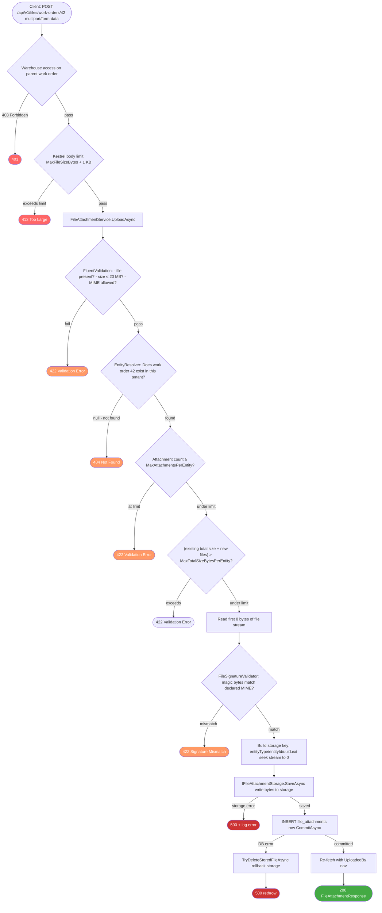

---

### Download Flow

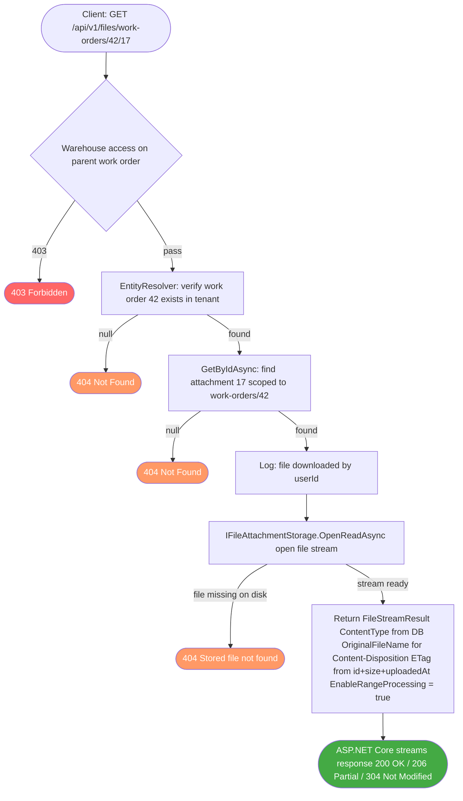

---

### Delete Flow

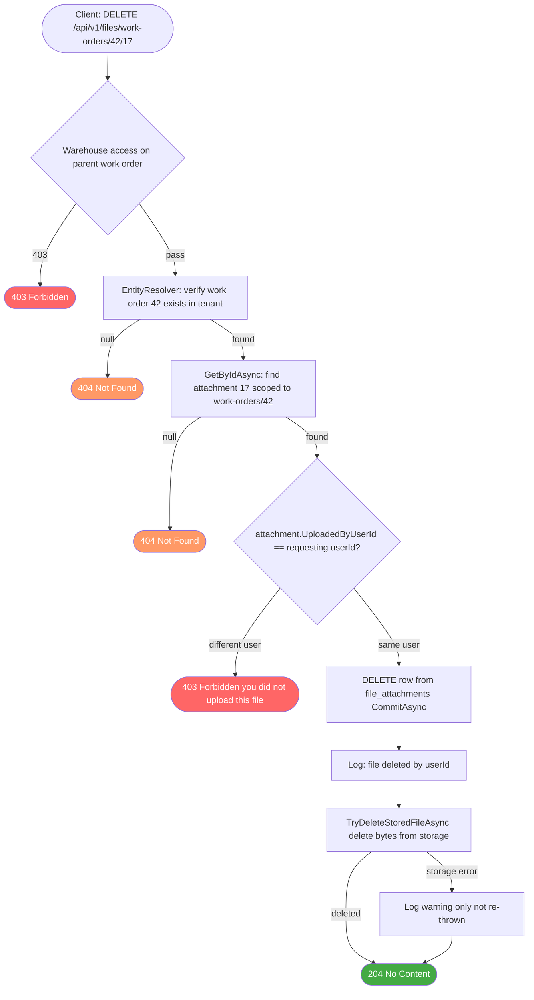

> **Why DB is deleted before storage:** If the DB commit fails after storage deletion, the DB row would still reference a deleted file - every subsequent download would 404. The safer order is DB first: an orphaned file on disk is a storage waste that can be cleaned up; a dangling DB row pointing to a missing file is a user-facing error.

---

### Magic-Byte Validation

The validator reads only the **first 8 bytes** of the upload stream - it never buffers the full file in memory. After the check, the stream is seeked back to position 0 and piped directly to storage.

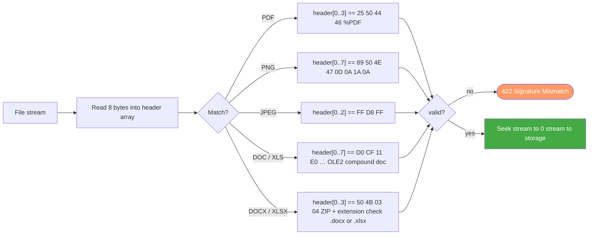

---

### Design Notes

- metadata is stored in PostgreSQL only; file bytes are stored through `IFileAttachmentStorage`
- **storage backend is selected at startup by config** - no code change required to switch providers:
  - `ObjectStorage:Endpoint` not set → `LocalFileAttachmentStorage` (local disk, development default)
  - `ObjectStorage:Endpoint` set → `S3FileAttachmentStorage` (any S3-compatible provider: MinIO, AWS S3, Cloudflare R2, Backblaze B2, Synology/QNAP NAS)
- storage keys are UUID-based (`entityType/entityId/{uuid}.ext`) and never expose server paths; the same key format works as a local filesystem path and as an S3 object key
- downloads proxy through the API (stream returned via `FileStreamResult`); no presigned URLs - all access is authenticated and tenant-scoped
- downloads are streamed with ASP.NET Core range processing enabled (ETag + 304/206 support)
- file is never fully buffered in memory - only the first 8 bytes are read for signature validation

### Security

- all endpoints require authentication; there is no attachment-specific permission
- access is inherited from the parent work order: `WorkOrderFileAttachmentEntityHandler` runs the same warehouse-access check as `WorkOrderService`, so a user outside the work order's warehouse gets `403` on upload, list, download and delete alike
- delete is additionally owner-only: only the uploader or the work order's creator can delete an attachment (`403 Forbidden` otherwise)
- tenant isolation is enforced via EF query filter - no cross-company file access is possible
- attachments on a non-editable (submitted/approved) work order are readable but cannot be added or removed

### Upload Validation

- file must be present and non-empty
- target entity must exist (within caller's tenant)
- file size must not exceed `FileAttachments:MaxFileSizeBytes` (default 20 MB)
- MIME type must be in the configured allowlist (default: PDF, PNG, JPEG, DOC, DOCX, XLS, XLSX)
- magic-byte signature is checked for all supported types
- per-record attachment count is limited by `FileAttachments:MaxAttachmentsPerEntity` (default 10)
- per-record **total** size (existing attachments + new uploads combined) is limited by `FileAttachments:MaxTotalSizeBytesPerEntity` (default 50 MB)

### Configuration

#### Upload limits and MIME types

Defined in `src/WAMS.Api/appsettings.json`:

```json
"FileAttachments": {
  "RootPath": "storage/attachments",
  "MaxFileSizeBytes": 20971520,
  "MaxTotalSizeBytesPerEntity": 52428800,
  "MaxAttachmentsPerEntity": 10,
  "AllowedMimeTypes": [
    "application/pdf",
    "image/png",
    "image/jpeg",
    "application/msword",
    "application/vnd.openxmlformats-officedocument.wordprocessingml.document",
    "application/vnd.ms-excel",
    "application/vnd.openxmlformats-officedocument.spreadsheetml.sheet"
  ]
}
```

> `MaxFileSizeBytes` is the single source of truth for size limits. The same value is used by the Application-layer validator **and** applied to Kestrel/IIS/FormOptions at startup - no duplication.

#### Storage backend

Storage is selected at startup based on whether `ObjectStorage:Endpoint` is set:

| `Endpoint` | Backend | Notes |
|---|---|---|
| empty (default) | `LocalFileAttachmentStorage` | Writes to `FileAttachments:RootPath` on disk. For development only - requires a persistent volume in containers. |
| set | `S3FileAttachmentStorage` | Any S3-compatible provider. `BucketName`, `AccessKey`, and `SecretKey` are all required when `Endpoint` is set; missing values cause a startup exception. |

```json
"ObjectStorage": {
  "Endpoint": "https://minio.yourcompany.com:9000",
  "AccessKey": "your-access-key",
  "SecretKey": "your-secret-key",
  "BucketName": "wams-attachments",
  "Region": "us-east-1",
  "ForcePathStyle": true
}
```

**Provider quick-reference:**

| Provider | `Endpoint` | `ForcePathStyle` |
|---|---|---|
| MinIO (self-hosted) | `https://minio.internal:9000` | `true` |
| AWS S3 | `https://s3.amazonaws.com` | `false` |
| Cloudflare R2 | `https://<account-id>.r2.cloudflarestorage.com` | `true` |
| Backblaze B2 | `https://s3.us-west-004.backblazeb2.com` | `false` |
| Synology / QNAP NAS | `https://nas.company.com:9000` | `true` |

All values can be supplied as environment variables (e.g. `ObjectStorage__Endpoint=...`). See `.env.example` for the full list.

### Extending with a New Entity Type

1. Implement `IFileAttachmentEntityHandler` (in `WAMS.Application.Interfaces`) in the Infrastructure layer
2. Register it in `Program.cs` as `IFileAttachmentEntityHandler`
3. The entity resolver picks it up automatically via DI enumeration - no other changes needed

---

## API Endpoints

### Public

| Method | Endpoint | Description |
|--------|----------|-------------|
| `GET` | `/api/v1/companies/public` | List active companies for login dropdown (no auth) |
| `POST` | `/api/v1/auth/login` | Authenticate with `{email, password, companyId}`; returns access + refresh tokens |
| `POST` | `/api/v1/auth/refresh` | Exchange refresh token for a new access token |
| `GET` | `/health` | Health check |

### Auth (authenticated)

| Method | Endpoint | Permission |
|--------|----------|------------|
| `POST` | `/api/v1/auth/logout` | Any authenticated user |
| `GET` | `/api/v1/auth/me` | Any authenticated user |
| `POST` | `/api/v1/auth/change-password` | Any authenticated user (self-service, requires current password; rate-limited 10/min per IP) |

### Users

| Method | Endpoint | Permission |
|--------|----------|------------|
| `GET` | `/api/v1/users` | `user.user.read` |
| `GET` | `/api/v1/users/export?format=Xlsx\|Csv\|Pdf` | `user.user.read` |
| `POST` | `/api/v1/users` | `user.user.create` |
| `GET` | `/api/v1/users/{id}` | `user.user.read` |
| `PUT` | `/api/v1/users/{id}` | `user.user.update` |
| `DELETE` | `/api/v1/users/{id}` | `user.user.delete` |
| `POST` | `/api/v1/users/{id}/password` | `user.user.reset_password` (admin reset, no current password required; rate-limited 10/min per IP) |
| `POST` | `/api/v1/users/{id}/roles/{roleId}` | `user.role.create` |
| `DELETE` | `/api/v1/users/{id}/roles/{roleId}` | `user.role.delete` |
| `POST` | `/api/v1/users/{id}/warehouses/{warehouseId}` | `user.warehouse.create` |
| `DELETE` | `/api/v1/users/{id}/warehouses/{warehouseId}` | `user.warehouse.delete` |
| `GET` | `/api/v1/users/{id}/permissions` | `user.permission.read` |
| `POST` | `/api/v1/users/{id}/permissions/{permissionId}/grant` | `user.permission.create` |
| `POST` | `/api/v1/users/{id}/permissions/{permissionId}/deny` | `user.permission.create` |
| `DELETE` | `/api/v1/users/{id}/permissions/{permissionId}` | `user.permission.delete` |
| `GET` | `/api/v1/users/{id}/permissions/effective` | `user.permission.read` |

### Roles

| Method | Endpoint | Permission |
|--------|----------|------------|
| `GET` | `/api/v1/roles` | `user.role.read` |
| `GET` | `/api/v1/roles/export?format=Xlsx\|Csv\|Pdf` | `user.role.read` |
| `POST` | `/api/v1/roles` | `user.role.create` |
| `GET` | `/api/v1/roles/{id}` | `user.role.read` |
| `PUT` | `/api/v1/roles/{id}` | `user.role.update` |
| `DELETE` | `/api/v1/roles/{id}` | `user.role.delete` |
| `POST` | `/api/v1/roles/{id}/permissions/{permissionId}` | `user.role.update` |
| `DELETE` | `/api/v1/roles/{id}/permissions/{permissionId}` | `user.role.update` |

### Permissions

| Method | Endpoint | Permission |
|--------|----------|------------|
| `GET` | `/api/v1/permissions` | `user.permission.read` |

### Warehouses

Warehouses are **read-only** in the API - master data is sourced exclusively from the ERP via background sync.

| Method | Endpoint | Permission |
|--------|----------|------------|
| `GET` | `/api/v1/warehouses` | `user.warehouse.read` |
| `GET` | `/api/v1/warehouses/export?format=Xlsx\|Csv\|Pdf` | `user.warehouse.read` |
| `GET` | `/api/v1/warehouses/{id}` | `user.warehouse.read` |

### Rate Cards

| Method | Endpoint | Permission |
|--------|----------|------------|
| `GET` | `/api/v1/rate-cards` | `budget.rate_card.read` |
| `GET` | `/api/v1/rate-cards/export?format=Xlsx\|Csv\|Pdf` | `budget.rate_card.read` |
| `GET` | `/api/v1/rate-cards/{id}` | `budget.rate_card.read` |
| `GET` | `/api/v1/rate-cards/by-item/{itemShadowId}` | `budget.rate_card.read` |
| `POST` | `/api/v1/rate-cards` | `budget.rate_card.create` |
| `POST` | `/api/v1/rate-cards/submit` | `budget.rate_card.create` + `budget.rate_card.submit` |
| `PUT` | `/api/v1/rate-cards/{id}` | `budget.rate_card.update` |
| `POST` | `/api/v1/rate-cards/{id}/submit` | `budget.rate_card.submit` |
| `DELETE` | `/api/v1/rate-cards/{id}` | `budget.rate_card.delete` |

### Activity Types

| Method | Endpoint | Permission |
|--------|----------|------------|
| `GET` | `/api/v1/activity-types` | `budget.template.read` |
| `GET` | `/api/v1/activity-types/{id}` | `budget.template.read` |
| `POST` | `/api/v1/activity-types` | `system.activity_type.create` |
| `PUT` | `/api/v1/activity-types/{id}` | `system.activity_type.update` |
| `DELETE` | `/api/v1/activity-types/{id}` | `system.activity_type.delete` |

### Budget Templates

| Method | Endpoint | Permission |
|--------|----------|------------|
| `GET` | `/api/v1/budget-templates` | `budget.template.read` |
| `GET` | `/api/v1/budget-templates/export?format=Xlsx\|Csv\|Pdf` | `budget.template.read` |
| `GET` | `/api/v1/budget-templates/{id}` | `budget.template.read` |
| `POST` | `/api/v1/budget-templates` | `budget.template.create` |
| `PUT` | `/api/v1/budget-templates/{id}` | `budget.template.update` |
| `DELETE` | `/api/v1/budget-templates/{id}` | `budget.template.delete` |
| `POST` | `/api/v1/budget-templates/{id}/submit` | `budget.template.submit` |
| `POST` | `/api/v1/budget-templates/{id}/approve` | `budget.template.approve` |

### Budget Plans

| Method | Endpoint | Permission |
|--------|----------|------------|
| `GET` | `/api/v1/budget-plans` | `budget.plan.read` |
| `GET` | `/api/v1/budget-plans/export?format=Xlsx\|Csv\|Pdf` | `budget.plan.read` |
| `GET` | `/api/v1/budget-plans/{id}` | `budget.plan.read` |
| `POST` | `/api/v1/budget-plans` | `budget.plan.create` |
| `PUT` | `/api/v1/budget-plans/{id}` | `budget.plan.update` |
| `DELETE` | `/api/v1/budget-plans/{id}` | `budget.plan.delete` |
| `POST` | `/api/v1/budget-plans/{id}/submit` | `budget.plan.submit` |
| `POST` | `/api/v1/budget-plans/{id}/approve` | `budget.plan.approve` |
| `POST` | `/api/v1/budget-plans/{id}/reject` | `budget.plan.reject` |

### Workflow Templates

| Method | Endpoint | Permission |
|--------|----------|------------|
| `GET` | `/api/v1/workflow-templates/doc-types` | `workflow.template.read` |
| `GET` | `/api/v1/workflow-templates` | `workflow.template.read` |
| `GET` | `/api/v1/workflow-templates/{id}` | `workflow.template.read` |
| `POST` | `/api/v1/workflow-templates` | `workflow.template.create` |
| `PUT` | `/api/v1/workflow-templates/{id}` | `workflow.template.update` |
| `POST` | `/api/v1/workflow-templates/{id}/activate` | `workflow.template.update` |
| `POST` | `/api/v1/workflow-templates/{id}/deactivate` | `workflow.template.update` |
| `DELETE` | `/api/v1/workflow-templates/{id}` | `workflow.template.delete` |

### Purchase Orders

| Method | Endpoint | Permission |
|--------|----------|------------|
| `GET` | `/api/v1/purchase-orders` | `budget.po.read` |
| `GET` | `/api/v1/purchase-orders/export?format=Xlsx\|Csv\|Pdf` | `budget.po.read` |
| `GET` | `/api/v1/purchase-orders/{id}` | `budget.po.read` |
| `GET` | `/api/v1/purchase-orders/available-items?budgetPlanId=&vendorShadowId=&page=&limit=` | `budget.po.read` | Cross-warehouse picker rooted at an active-warehouse seed BP |
| `GET` | `/api/v1/purchase-orders/{id}/available-items?page=&limit=` | `budget.po.read` | Edit picker; the route ID is excluded server-side |
| `POST` | `/api/v1/purchase-orders` | `budget.po.create` |
| `POST` | `/api/v1/purchase-orders/generate` | `budget.po.generate` |
| `PUT` | `/api/v1/purchase-orders/{id}` | `budget.po.update` |
| `DELETE` | `/api/v1/purchase-orders/{id}` | `budget.po.delete` |
| `POST` | `/api/v1/purchase-orders/{id}/generate` | `budget.po.generate` |

### Account Payables

| Method | Endpoint | Permission |
|--------|----------|------------|
| `GET` | `/api/v1/account-payables` | `workorder.ap.read` |
| `GET` | `/api/v1/account-payables/{id}` | `workorder.ap.read` |
| `GET` | `/api/v1/account-payables/available-items?vendorShadowId=&budgetPlanIds=` | `workorder.ap.read` |
| `GET` | `/api/v1/account-payables/{id}/available-items?vendorShadowId=&budgetPlanIds=` | `workorder.ap.read` |
| `POST` | `/api/v1/account-payables/preview` | `workorder.ap.read` |
| `POST` | `/api/v1/account-payables` | `workorder.ap.create` |
| `POST` | `/api/v1/account-payables/generate` | `workorder.ap.generate` |
| `PUT` | `/api/v1/account-payables/{id}` | `workorder.ap.update` |
| `DELETE` | `/api/v1/account-payables/{id}` | `workorder.ap.delete` |
| `POST` | `/api/v1/account-payables/{id}/generate` | `workorder.ap.generate` |

### Work Orders

| Method | Endpoint | Permission |
|--------|----------|------------|
| `GET` | `/api/v1/work-orders/approved-plans` | `workorder.workorder.read` |
| `GET` | `/api/v1/work-orders` | `workorder.workorder.read` |
| `GET` | `/api/v1/work-orders/export?format=Xlsx\|Csv\|Pdf` | `workorder.workorder.read` |
| `GET` | `/api/v1/work-orders/{id}` | `workorder.workorder.read` |
| `PUT` | `/api/v1/work-orders/{id}` | `workorder.workorder.update` |
| `DELETE` | `/api/v1/work-orders/{id}` | `workorder.workorder.delete` |
| `POST` | `/api/v1/work-orders/{id}/submit` | `workorder.workorder.submit` |

### Recap Work Orders

| Method | Endpoint | Permission |
|--------|----------|------------|
| `GET` | `/api/v1/recap-work-orders` | `workorder.recap.read` |
| `GET` | `/api/v1/recap-work-orders/export?format=Xlsx\|Csv\|Pdf` | `workorder.recap.read` |
| `GET` | `/api/v1/recap-work-orders/{id}` | `workorder.recap.read` |
| `POST` | `/api/v1/recap-work-orders/{id}/approve` | `workorder.recap.approve` |
| `POST` | `/api/v1/recap-work-orders/{id}/reject` | `workorder.recap.reject` |

### Finance Reports

| Method | Endpoint | Permission |
|--------|----------|------------|
| `GET` | `/api/v1/finance-reports` | `report.finance-report.read` |
| `GET` | `/api/v1/finance-reports/{budgetPlanId}` | `report.finance-report.read` |
| `GET` | `/api/v1/finance-reports/{budgetPlanId}/export?workOrderId={id}&format=Xlsx\|Csv\|Pdf` | `report.finance-report.export` |

### RCA

| Method | Endpoint | Permission |
|--------|----------|------------|
| `GET` | `/api/v1/rca/export?warehouseCode=&dateFrom=&dateTo=` | `rca.report.export` |

Response: `application/pdf`. Filename: `RCA-{warehouseCode}-{dateFrom:yyyyMMdd}-{dateTo:yyyyMMdd}.pdf`. Returns `400` when `dateFrom > dateTo`.

### Dashboard

| Method | Endpoint | Permission |
|--------|----------|------------|
| `GET` | `/api/v1/dashboard/summary` | `report.dashboard.read` |
| `GET` | `/api/v1/dashboard/activities` | `report.dashboard.read` |
| `GET` | `/api/v1/dashboard/history?year=&month=` | `report.dashboard.read` |

### Files

| Method | Endpoint | Permission |
|--------|----------|------------|
| `POST` | `/api/v1/files/work-orders/{id}` | inherits `workorder.workorder.update` + warehouse access |
| `GET` | `/api/v1/files/work-orders/{id}` | inherits `workorder.workorder.read` + warehouse access |
| `GET` | `/api/v1/files/work-orders/{id}/{fileId}` | inherits `workorder.workorder.read` + warehouse access |
| `DELETE` | `/api/v1/files/work-orders/{id}/{fileId}` | uploader or work order owner, + warehouse access |

**Supported entity types:** `budget-plans`, `budget-templates`

### Sync (System Administration)

| Method | Endpoint | Permission |
|--------|----------|------------|
| `POST` | `/api/v1/sync/trigger` | `system.sync.execute` |
| `POST` | `/api/v1/sync/trigger/{serviceName}` | `system.sync.execute` |
| `GET` | `/api/v1/sync/logs` | `system.sync.read` |
| `GET` | `/api/v1/sync/logs/latest` | `system.sync.read` |

#### ERP Sync Policy

All scheduled sync services (`ItemSyncService`, `VendorSyncService`, `WarehouseSyncService`, `SpkSyncService`, `ToSyncService`, `PpnSyncService`) follow the same policy per company:

### Background Schedulers

| Scheduler | Class | Mechanism | Purpose |
|---|---|---|---|
| ERP Master Data Sync | `MasterDataSyncBackgroundService` | `Task.Delay`, interval recomputed every cycle: fast inside a configurable peak window, slow outside it (defaults: 5 min / 60 min, weekdays 08:00–17:00 WIB) | Upserts warehouses, vendors, items, SPKs, transport orders, and PPN tax codes from ERP |
| BP Approval Reminder | `BudgetPlanReminderBackgroundService` | `Task.Delay` to next window slot; runs only within configured hours | Notifies approvers when a BP has been pending > threshold hours |

Both use `IServiceScopeFactory` (fresh `DbContext` per run). The BP reminder can be disabled independently via `BudgetPlanReminder:Enabled=false`.

**ERP sync's peak/off-peak interval** (`MasterDataSyncBackgroundService.GetIntervalMinutes`) - every cycle, not just at startup, it converts "now" into `ErpApi:SyncPeakTimeZoneId` (default `Asia/Jakarta`, falls back to UTC with a warning if the IANA ID is invalid) and checks whether that local time falls inside `[ErpApi:SyncPeakWindowStartHour, ErpApi:SyncPeakWindowEndHour)` - weekdays-only unless `ErpApi:SyncPeakWeekdaysOnly=false`. Inside the window it delays `ErpApi:SyncIntervalMinutesPeak` (default 5) minutes; outside it, `ErpApi:SyncIntervalMinutes` (default 60). The staleness check (`CheckForStaleServicesAsync`, 2× the interval) uses this same currently-active interval, so it doesn't false-alarm right at the peak/off-peak boundary.

`PphLookupService` is deliberately **not** part of `MasterDataSyncBackgroundService` - PPh master data is vendor-scoped in SAP (`GET /WAMS/PPh?Company=&CardCode=`), so a scheduled bulk sync would mean one SAP call per vendor per tick. Instead it's fetched live, on-demand, only when `GET /rate-cards/vendors/{vendorId}/pph` is called - see [Managing tax types](#managing-tax-types).

The BP reminder scheduler does **not** run 24/7. It computes the delay to the next valid run time within the configured active window and sleeps until then - no wasted ticks outside working hours. With defaults (every 60 min, 09:00–17:00 WIB), it fires at 09:00, 10:00, … 16:00 and then sleeps until next day 09:00.

| Config key | Default | Description |
|---|---|---|
| `BudgetPlanReminder:IntervalMinutes` | `60` | Interval between runs within the window |
| `BudgetPlanReminder:ThresholdHours` | `24` | Hours a BP must be pending before triggering a reminder |
| `BudgetPlanReminder:CooldownHours` | `24` | Minimum hours between reminders for the same approver - prevents spam |
| `BudgetPlanReminder:ActiveWindowStartHour` | `9` | First hour of day (local time) when runs are allowed |
| `BudgetPlanReminder:ActiveWindowEndHour` | `17` | Exclusive upper bound - no runs at or after this hour |
| `BudgetPlanReminder:TimeZoneId` | `Asia/Jakarta` | IANA timezone for interpreting the active window |

**Aggregation:** overdue BPs are grouped by `(company, warehouse, stage)` and approvers are queried once per group. Each approver receives **one** notification summarising all their pending BPs - notification count is O(approvers), not O(BPs). Whether there are 1 or 100 overdue BPs, an approver gets exactly one in-app notification and one email per cooldown window.

**Spam prevention:** the cooldown is checked per approver against the `notifications` table. If a `budget_plan_approval_reminder` was already sent to that user within `CooldownHours`, the entire batch for them is skipped. With defaults, each approver receives at most one reminder per day (at the 09:00 run).

### Notification System

In-app notifications are persisted to the `notifications` table and pushed to connected clients in real time using **Server-Sent Events (SSE)**. There are two layers:

1. **Persistence** - every notification is written to the DB first (durable, queryable, paginated inbox)
2. **Real-time dispatch** - after the DB write, the notification is pushed through an `INotificationRealtimeDispatcher` to any active SSE connections for that user

#### Architecture Flow

```
Publisher (BudgetPlanService / BPReminderBackgroundService / /test endpoint)
    └─► INotificationService.PublishAsync()
            ├─► DB write  (notifications table - always happens first)
            └─► INotificationRealtimeDispatcher.PublishAsync()  ← fire-and-forget; failure is logged, never thrown
                    └─► SSE stream (GET /api/v1/notifications/stream)
```

If the API restarts or an SSE client disconnects, the notification is still in the DB - the user will see it when they next call the list endpoint or reconnect.

#### API Endpoints

| Method | Endpoint | Description |
|--------|----------|-------------|
| `GET` | `/api/v1/notifications` | Paginated inbox for the logged-in user |
| `POST` | `/api/v1/notifications/{id}/read` | Mark a single notification as read (`204 No Content`) |
| `POST` | `/api/v1/notifications/test` | Send a test notification to yourself (dev/testing) |
| `GET` | `/api/v1/notifications/stream` | SSE long-poll - pushes live notifications to this connection |

All four endpoints require a valid JWT (`[Authorize]`). There are no separate permission gates - any authenticated user accesses their own notifications only; the repository filters by `recipient_user_id` at the query level so cross-user leakage is impossible.

**List query parameters** (`GET /api/v1/notifications`):

| Param | Default | Description |
|-------|---------|-------------|
| `page` | `1` | Page number (1-based) |
| `limit` | `20` | Items per page |
| `unreadOnly` | `false` | When `true`, returns only unread notifications |

Response shape: `PaginatedResponse<NotificationResponse>` with the standard `meta.{page,limit,total,totalPages}` envelope.

#### SSE Stream (`GET /api/v1/notifications/stream`)

The connection stays open indefinitely. Three event types are sent:

| SSE event | When | Payload |
|-----------|------|---------|
| `connected` | Immediately on open | `{ "user_id": 42 }` |
| `heartbeat` | Every 30 s (configurable) | `{ "timestamp": "2026-06-26T..." }` |
| `notification` | When a new notification arrives | `NotificationResponse` JSON |

The stream also sends `retry: 5000` on connect - browsers that lose the connection will automatically reconnect after 5 s.

**Configuring the heartbeat interval** (`appsettings.json`):

```json
"Notifications": {
  "HeartbeatIntervalSeconds": 30
}
```

#### Notification Data Fields

Each notification record has these fields (exposed in `NotificationResponse`):

| Field | Type | Description |
|-------|------|-------------|
| `id` | `long` | Unique notification ID |
| `type` | `string` | Event type key (see table below) |
| `title` | `string` | Short human-readable title (max 200 chars) |
| `message` | `string` | Full notification body (max 500 chars) |
| `referenceType` | `string` | Entity type the notification points to, e.g. `"budget_plan"` |
| `referenceId` | `string` | ID of the referenced entity as a string |
| `status` | `"read"` \| `"unread"` | Whether the user has read it |
| `createdAt` | `DateTime` | When the notification was created (UTC) |
| `readAt` | `DateTime?` | When it was marked read (UTC), or `null` |
| `recipientUserId` | `long` | Who this notification belongs to |
| `actorUserId` | `long?` | Who triggered it - `null` for system-generated events (e.g. scheduled reminders) |

#### Notification Types

| Type key | Who is notified | Trigger |
|----------|----------------|---------|
| `budget_plan_stage_approved` | Creator of the BP | A stage was approved but more stages remain |
| `budget_plan_pending_approval` | Next-stage approvers | Triggered at the same time as `stage_approved` - the users who need to act on the next stage |
| `budget_plan_approved_final` | Creator of the BP | Final stage approved - BP is now fully `Approved` |
| `budget_plan_rejected` | Creator of the BP | BP was rejected at any stage |
| `budget_plan_approval_reminder` | Current-stage approvers | BP has been pending longer than `ThresholdHours` (sent by the background scheduler) |

#### Real-time Dispatcher

**`InMemoryNotificationRealtimeDispatcher`** (the registered single-process implementation):
- Stores subscriptions in a `ConcurrentDictionary<userId, ConcurrentDictionary<subscriptionId, Channel<T>>>`
- Uses `Channel.CreateUnbounded<T>()` - no backpressure limit
- When the SSE connection closes (CancellationToken fires), the subscription is removed and the channel writer is completed

This fan-out works for all active clients connected to the same API process. Exactly one API process is required; clients reconnect after a restart, and persisted notifications remain available through the inbox endpoint.

#### Database Schema (`notifications` table)

| Column | Type | Constraints |
|--------|------|-------------|
| `id` | `bigint` | PK, auto-increment |
| `company_id` | `bigint` | FK → companies (Restrict) |
| `recipient_user_id` | `bigint` | FK → users (Cascade delete) |
| `actor_user_id` | `bigint?` | FK → users (Restrict), nullable |
| `type` | `varchar(100)` | Not null |
| `title` | `varchar(200)` | Not null |
| `message` | `varchar(500)` | Not null |
| `reference_type` | `varchar(100)` | Not null |
| `reference_id` | `varchar(100)` | Not null |
| `is_read` | `bool` | Default false |
| `read_at` | `timestamp?` | Set when marked read |
| `created_at` | `timestamp` | Set on insert |
| `updated_at` | `timestamp` | Set on mark-read |

**Indexes:**

| Index name | Columns | Purpose |
|---|---|---|
| `ix_notifications_recipient_read_created_at` | `(recipient_user_id, is_read, created_at)` | Powers the inbox list query (filter + sort) |
| `ix_notifications_company_reference` | `(company_id, reference_type, reference_id)` | Future entity-level notification lookup |
| `ix_notifications_type_recipient_created_at` | `(type, recipient_user_id, created_at)` | Powers the BP reminder cooldown check (`ExistsByTypeAndRecipientAsync`) |

#### Design Notes

- **Deduplication in `PublishAsync`**: if the caller accidentally passes duplicate `NotificationCreateRequest` objects (same type, recipient, reference, etc.), the service groups them and inserts only one row per unique combination.
- **Mark-as-read is idempotent**: calling `POST /{id}/read` on an already-read notification returns `204` immediately without a DB write.
- **Real-time dispatch is fire-and-forget**: a dispatcher failure never propagates to the caller. The notification is already safe in the DB; the user will see it on next page load.
- **Recipient isolation**: `GetByIdAsync` and `GetByRecipientAsync` always filter by `recipient_user_id` - it is impossible for one user to read or acknowledge another user's notifications.

### Email Service

Email sending is an optional layer on top of in-app notifications. Controlled by `Email:Enabled`:

- **`false` (default)** - `NullEmailService` is registered; send calls are no-ops (logged at Debug level)
- **`true`** - `SmtpEmailService` is registered; sends via **MailKit** (`MailKit.Net.Smtp.SmtpClient`)

`SmtpEmailService` reuses a single SMTP connection per batch, validates TLS certificates by default, and handles both STARTTLS (port 587) and SSL-on-connect (port 465) via `SecureSocketOptions.Auto`.

Configure via environment variables (see `.env.example`):

```
Email__Enabled=true
Email__Host=smtp.yourprovider.com
Email__Port=587
Email__Username=user@example.com
Email__Password=secret
Email__FromAddress=noreply@example.com
Email__FromName=WAMS System
Email__UseSsl=true
```

> `IEmailService` is the single swap point - to add OAuth2 / XOAUTH2 support or a transactional email provider (SendGrid, Mailgun), implement the interface and register it instead of `SmtpEmailService`.

| ERP response | Behaviour |
|---|---|
| `null` | Skip - log warning, no changes made |
| `[]` empty array | Skip - log warning, no changes made (guards against false mass-deactivation from ERP errors) |
| Non-empty list | Upsert all returned records; soft-deactivate any local record absent from the response (`IsActive = false`) |

Shadow rows are **never hard-deleted** - downstream records (`BudgetPlanItem`, `RateCardItem`, `BudgetTemplateItem`, `UserWarehouse`) hold FK references to them and must remain intact for historical accuracy.

### Companies (System Administration)

| Method | Endpoint | Permission |
|--------|----------|------------|
| `GET` | `/api/v1/companies/public` | None (anonymous) |
| `GET` | `/api/v1/companies` | `system.company.read` |
| `GET` | `/api/v1/companies/{id}` | `system.company.read` |
| `POST` | `/api/v1/companies` | `system.company.create` |
| `PUT` | `/api/v1/companies/{id}` | `system.company.update` |
| `DELETE` | `/api/v1/companies/{id}` | `system.company.delete` |
| `POST` | `/api/v1/companies/{companyId}/users/{userId}` | `system.company.assign` |

### Response Envelope

All responses use a consistent envelope format:

```jsonc
// Success
{
  "success": true,
  "message": "Operation completed",
  "data": { }
}

// Paginated
{
  "success": true,
  "data": [ ],
  "meta": { "page": 1, "limit": 20, "total": 100, "totalPages": 5 }
}

// Error
{
  "success": false,
  "message": "Validation failed",
  "error": { "code": "VALIDATION_ERROR", "details": ["email is required"] }
}
```

---

## Testing

### Test Layout

```
tests/
├── WAMS.Application.Tests/         # Unit tests - services + validators (mocked dependencies)
│   ├── Helpers/
│   │   └── TestBuilders.cs
│   ├── Services/
│   │   ├── AuthServiceTests.cs
│   │   ├── BudgetPlanServiceTests.cs
│   │   ├── CompanyServiceTests.cs
│   │   ├── RbacServiceTests.cs
│   │   ├── UserServiceTests.cs
│   │   └── WarehouseShadowServiceTests.cs
│   └── Validators/
│       ├── CreateCompanyRequestValidatorTests.cs
│       ├── CreateUserRequestValidatorTests.cs
│       └── LoginRequestValidatorTests.cs
│
├── WAMS.Api.Tests/                 # Unit tests - controllers + middleware + filter (mocked)
│   ├── Controllers/
│   │   ├── AuthControllerTests.cs
│   │   └── UsersControllerTests.cs
│   ├── Filters/
│   │   └── RequirePermissionAttributeTests.cs
│   └── Middleware/
│       └── ExceptionHandlingMiddlewareTests.cs
│
└── WAMS.Infrastructure.Tests/      # Unit tests - caching decorators (real HybridCache, mocked inner)
    └── Caching/
        ├── CacheTestFixture.cs                    # Shared in-process HybridCache setup
        ├── HybridUserPermissionInvalidatorTests.cs
        ├── CachedRbacServiceTests.cs
        ├── CachedUomServiceTests.cs
        ├── CachedActivityTypeServiceTests.cs
        ├── CachedRateCardServiceTests.cs
        ├── CachedWorkflowTemplateServiceTests.cs
        └── CachedWarehouseShadowServiceTests.cs
```

See [TESTING.md](./TESTING.md) for full documentation on writing and running tests.

### Running Tests

```bash
make test                # Run Application + Api tests
make test-coverage       # Run with XPlat Code Coverage collection

dotnet test tests/WAMS.Application.Tests/
dotnet test tests/WAMS.Api.Tests/
dotnet test tests/WAMS.Infrastructure.Tests/
dotnet test WAMS.sln     # All three projects at once
```

---

## Caching

WAMS uses **`HybridCache`** (`Microsoft.Extensions.Caching.Hybrid`) as a local-only in-process cache. It preserves the existing cache decorators, keys, tags, stampede protection, and write-triggered invalidation without requiring a distributed provider.

### Local Architecture

```
┌─────────────────────────────────────────────────────────────────┐
│  API Process                                                    │
│                                                                 │
│   Controller → CachedXxxService                                 │
│                       │                                         │
│               ┌───────▼────────┐                               │
│               │ Local HybridCache│  in-process, zero network   │
│               │  (per-process)   │  configured TTL             │
│               └───────┬─────────┘                               │
│                       │ MISS                                    │
└───────────────────────┼─────────────────────────────────────────┘
                        │
               ┌────────▼────────┐
               │  PostgreSQL     │  authoritative source
               └─────────────────┘
```

- **Local cache** - in-process `HybridCache` memory storage with zero network overhead. Entries use one configured TTL and are reconstructed from PostgreSQL or SAP after eviction.

On a cache **miss**: local cache → database/external source. `HybridCache` still provides stampede protection for concurrent requests.

#### Read Path Flow

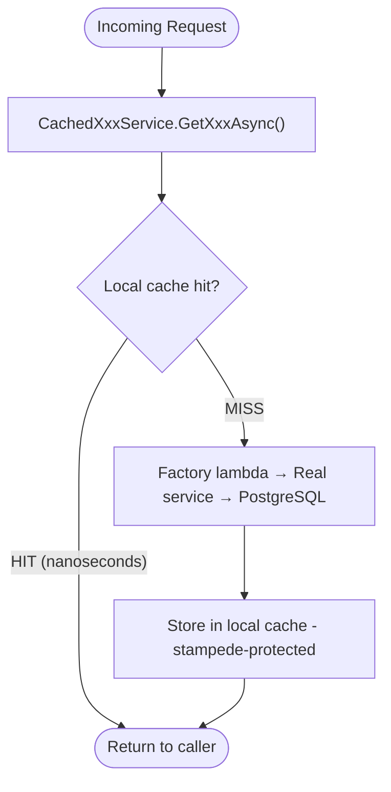

#### Stampede Protection

If 100 concurrent requests arrive for the same cold key, `HybridCache` calls the factory lambda (the DB query) **exactly once** and fans the result out to all 100 waiters. The old `IMemoryCache.GetOrCreate` pattern did not do this.

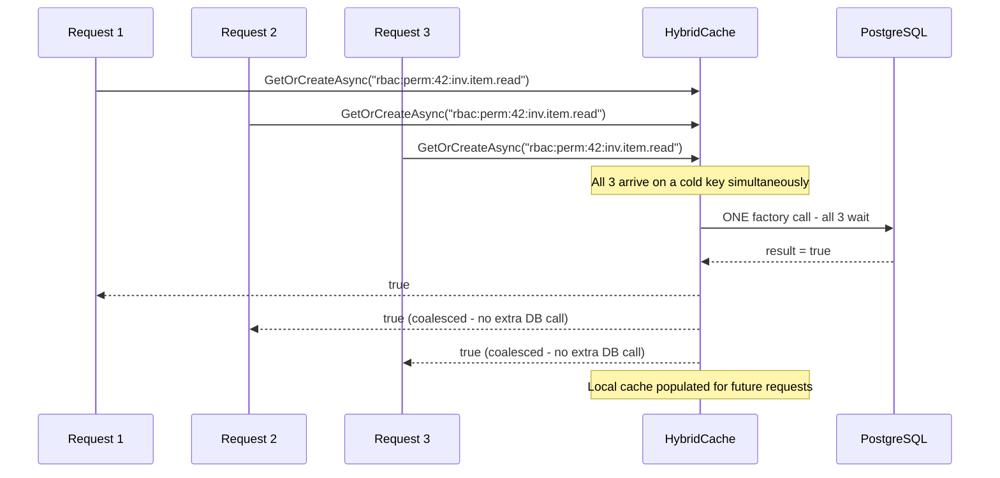

---

### Pattern: Decorator

Business logic (Application layer) never references the cache. Each cacheable `IXxxService` has a corresponding `CachedXxxService` in `WAMS.Infrastructure/Caching/` that wraps it transparently. The wiring uses .NET **keyed DI**:

```csharp
// Program.cs - example for IRbacService
builder.Services.AddKeyedScoped<IRbacService, RbacService>("real");  // real impl, keyed
builder.Services.AddScoped<IRbacService, CachedRbacService>();        // decorator, primary

// CachedRbacService constructor - injects the real one by key
public CachedRbacService(
    [FromKeyedServices("real")] IRbacService inner,
    HybridCache cache,
    IOptions<WamsCacheOptions> options) { ... }
```

Controllers and other services always resolve `IRbacService` (the primary). They never know caching exists.

**All 7 decorated services follow this exact pattern:**

| Interface | Real Impl | Cached Decorator |
|---|---|---|
| `IRbacService` | `RbacService` | `CachedRbacService` |
| `IUomService` | `UomService` | `CachedUomService` |
| `IActivityTypeService` | `ActivityTypeService` | `CachedActivityTypeService` |
| `IWorkflowTemplateService` | `WorkflowTemplateService` | `CachedWorkflowTemplateService` |
| `IWarehouseShadowService` | `WarehouseShadowService` | `CachedWarehouseShadowService` |
| `IRateCardService` | `RateCardService` | `CachedRateCardService` |
| `ITaxTypeService` | `TaxTypeService` | `CachedTaxTypeService` |

Every read in the decorator follows the same `GetOrCreateAsync` pattern:

```csharp
public async Task<bool> HasPermissionAsync(
    long userId, string module, string resource, string action, CancellationToken ct = default)
    => await _cache.GetOrCreateAsync(
        CacheKeys.RbacPerm(userId, module, resource, action),   // cache key
        async cancel => await _inner.HasPermissionAsync(...),    // factory (called on miss)
        _permOpts,                                               // TTL options
        [CacheTags.RbacUser(userId), CacheTags.RbacAllPerms],  // tags for invalidation
        ct);
```

Every write in the decorator delegates to the real service, then evicts by tag:

```csharp
public async Task SyncPermissionsAsync(long roleId, SyncPermissionsRequest request, ...)
{
    await _inner.SyncPermissionsAsync(roleId, request, ...);    // real DB write first
    await _cache.RemoveByTagAsync(CacheTags.RbacAllPerms, ct); // evict after commit
}
```

---

### What Is Cached

All cache keys and tag strings live in `WAMS.Infrastructure/Caching/CacheKeys` and `CacheTags` as constants - never hardcoded in decorators.

| Service | Cached Methods | Cache Key Pattern | Tag(s) | TTL |
|---|---|---|---|---|---|
| `IRbacService` | `HasPermissionAsync`, `HasGlobalAccessAsync` | `rbac:perm:{userId}:{m}.{r}.{a}`, `rbac:global:{userId}` | `rbac-user:{userId}`, `rbac-all-perms` | 60 s |
| `IRbacService` | `GetAllPermissionsAsync` | `rbac:catalog` | `permissions-catalog` | 300 s |
| `IUomService` | `GetAllAsync`, `GetByIdAsync` | `uom:all:{activeOnly}`, `uom:{id}` | `uom` | 300 s |
| `IActivityTypeService` | `GetAllAsync`, `GetByIdAsync` | `activity-type:all`, `activity-type:{id}` | `activity-types` | 300 s |
| `IWorkflowTemplateService` | `GetAllAsync`, `GetByIdAsync` | `workflow-template:all:{companyId}:dt…:s…:sb…:so…:p…:l…`, `workflow-template:{id}:{companyId}` | `workflow-templates:{companyId}` | 300 s |
| `IWarehouseShadowService` | `GetAllAsync`, `GetByIdAsync`, `GetDistinctLocationsAsync` | `warehouse-shadow:all:{userId}:s…:loc…:sb…:so…:p…:l…`, `warehouse-shadow:{id}:{userId}`, `warehouse-shadow:locations:{userId}` | `warehouse-shadows` | 120 s |
| `IRateCardService` | `GetByIdAsync` only | `rate-card:{id}` | `rate-cards` | 120 s |
| `ITaxTypeService` | `GetAllAsync`, `GetByIdAsync` | `tax-type:all:{category}:{activeOnly}`, `tax-type:{id}` | `tax-types` | 300 s |

**Key design notes:**
- RBAC keys include `userId` - user A cannot read user B's cached permission check.
- WarehouseShadow keys are per-`userId` because warehouse visibility is access-controlled per user.
- WorkflowTemplate and WarehouseShadow keys embed all query parameters (search, page, sort) so each unique query gets its own entry. Tag-based invalidation clears them all at once on any write.
- `WorkflowTemplateService.GetAllAsync` returns a C# value tuple `(List<...>, int)`. System.Text.Json cannot serialize value tuples, so the decorator wraps it in a private `record PageResult` for storage and unwraps on return.

### Why Not Cache Everything

| Service | Reason |
|---|---|
| `BudgetTemplateService` | Has approval workflow; status changes frequently |
| `BudgetPlanService` | Core transactional - mutations dominate |
| `WorkOrderService` | Same as BudgetPlan |
| `RecapWorkOrderService` | Same |
| `AccountPayableService` | Transactional document with workflow states |
| `PurchaseOrderService` | Same |
| `RateCardService.GetAllAsync` | Paginated + multi-filter; too many unique key combinations relative to benefit |

---

### Tag-Based Invalidation

Tags are the central invalidation mechanism. Each cache entry is tagged at write time. On any mutation, `RemoveByTagAsync(tag)` evicts all local entries with that tag without knowing individual key names.

#### Tag Hierarchy

```
rbac-all-perms              ← ALL users' RBAC entries; cleared on any role-level change
rbac-user:{userId}          ← One user's entries; cleared on per-user override change
permissions-catalog         ← Full permission list; cleared on seed/deploy
uom                         ← All UoM entries
activity-types              ← All ActivityType entries
workflow-templates:{companyId}   ← All templates for one company; other companies untouched
warehouse-shadows           ← ALL users' ERP warehouse data; cleared after WarehouseSync
rate-cards                  ← All RateCard GetById entries
tax-types                   ← All TaxType entries (GetAll + GetById, every category/activeOnly combo); cleared after a PpnSync run or a PphLookupService refresh
```

#### Invalidation Map

| Trigger | Tag Cleared | Scope |
|---|---|---|
| `RbacService.CreateRole / UpdateRole / DeleteRole` | `rbac-all-perms` | All users |
| `RbacService.AssignPermission / RemovePermission / SyncPermissions` | `rbac-all-perms` | All users |
| `RbacService.GrantUserPermission / DenyUserPermission / RemoveUserPermission` | `rbac-user:{userId}` | One user only |
| **`UserService.AssignRoleAsync / RemoveRoleAsync`** | **`rbac-user:{userId}`** | **One user only** (via `IUserPermissionInvalidator`) |
| `UomService.Create / Update / Delete` | `uom` | Global |
| `ActivityTypeService.Create / Update / Delete` | `activity-types` | Global |
| `WorkflowTemplateService.Create / Update / Activate / Deactivate / Delete` | `workflow-templates:{companyId}` | One company |
| ERP `WarehouseSync` completes (`MasterDataSyncBackgroundService`) | `warehouse-shadows` | All users |
| `RateCardService.Create / Update / Submit / Delete` | `rate-cards` | Global |
| `PpnSyncService` completes a scheduled run | `tax-types` **and** `rate-cards` | Global |
| `PphLookupService.GetOrRefreshAsync` completes a successful (non-fallback) refresh | `tax-types` **and** `rate-cards` | Global |

> `TaxTypeService` writes clear **two** tags: the `CachedTaxTypeService` decorator drops `tax-types` (its own cached reads), and the inner `TaxTypeService` additionally calls `ICacheInvalidationService.InvalidateRateCardsAsync` to drop `rate-cards`. The `rate-cards` bust is defensive: rate card responses render tax from the item's frozen snapshot columns (`PpnTaxTypeCode`/`PpnRate`, `PphTaxTypeCode`/`PphRate`), not a live join to `tax_types`, so an edited/deactivated tax type never actually changes an already-saved rate card response.

#### Cross-Service Invalidation: `IUserPermissionInvalidator`

Role mutations in `CachedRbacService` self-invalidate because they live inside the decorator. But `UserService.AssignRoleAsync` / `RemoveRoleAsync` live in the Application layer and bypass the decorator. Without explicit invalidation, a user's cached `HasPermissionAsync` result would remain stale until the local TTL (60 s) expires - users would be denied access to a newly assigned role, or retain access after a role is removed.

The fix uses a dedicated interface to keep `IRbacService` clean of cache concerns:

```
Application layer             Infrastructure layer
─────────────────             ────────────────────
IUserPermissionInvalidator    HybridUserPermissionInvalidator
     (interface)                (implementation)
                                    └── HybridCache.RemoveByTagAsync("rbac-user:{userId}")
```

`UserService` injects `IUserPermissionInvalidator` and calls `InvalidateAsync(userId)` immediately after the DB commit:

```csharp
// UserService.AssignRoleAsync (simplified)
await _rbacRepo.AssignRoleToUserAsync(userId, role.Id, ct);
await _uow.CommitAsync(ct);
await _permissionInvalidator.InvalidateAsync(userId, ct); // clears rbac-user:{userId} tag
```

The invalidation is synchronous: by the time the API response is returned, the cache is already cleared. The next request for that user hits the DB and gets fresh permissions - no TTL wait required.

#### Invalidation Flow: Role Permission Change

When an admin changes a role's permissions, every user who has that role needs fresh permission checks. The decorator clears the `rbac-all-perms` tag - one call evicts all users.

```mermaid
sequenceDiagram
    participant Admin as Admin
    participant CS as CachedRbacService
    participant RS as RbacService (real)
    participant DB as PostgreSQL
    participant HC as HybridCache
    participant Local as Local Memory

    Admin->>CS: SyncPermissionsAsync(roleId=5, ...)
    CS->>RS: SyncPermissionsAsync(...)
    RS->>DB: UPDATE role_permissions
    DB-->>RS: OK
    RS-->>CS: committed
    CS->>HC: RemoveByTagAsync("rbac-all-perms")
    HC->>Local: Evict all entries tagged "rbac-all-perms"
    Note over Local: ALL users' RBAC caches cleared in this process
    CS-->>Admin: RoleResponse
    Note over DB: Next perm check for any user → local miss → DB → re-cached
```

#### Invalidation Flow: Per-User Override (Targeted)

When granting or denying an individual user a permission override, only that user's entries are cleared. Other users are unaffected.

```mermaid
sequenceDiagram
    participant Admin as Admin
    participant CS as CachedRbacService
    participant RS as RbacService (real)
    participant DB as PostgreSQL
    participant HC as HybridCache

    Admin->>CS: GrantUserPermissionAsync(userId=42, permId=9, ...)
    CS->>RS: GrantUserPermissionAsync(...)
    RS->>DB: INSERT user_permissions (userId=42)
    DB-->>RS: OK
    RS-->>CS: committed
    CS->>HC: RemoveByTagAsync("rbac-user:42")
    Note over HC: Only user 42's entries evicted
    Note over HC: Users 43, 44, 45 ... caches untouched
    CS-->>Admin: OK
```

#### Invalidation Flow: ERP Warehouse Sync (Background Service)

After the background sync upserts ERP warehouse data, all users' warehouse shadow caches are cleared. The tag is global (not per-user) because the sync service doesn't know which users are affected by a warehouse data change.

```mermaid
sequenceDiagram
    participant S as MasterDataSyncBackgroundService
    participant W as WarehouseSyncService
    participant DB as PostgreSQL
    participant HC as HybridCache

    S->>W: SyncAllAsync()
    W->>DB: UPSERT warehouse_shadows (all companies, parallel)
    DB-->>W: added=3, updated=7, deactivated=1
    W-->>S: SyncResult { Success=true, ServiceName="WarehouseSync" }
    S->>HC: RemoveByTagAsync("warehouse-shadows")
    Note over HC: All users' warehouse shadow caches cleared
    Note over HC: Next request hits DB → re-populated from fresh ERP data
```

---

### Process Lifecycle and Deployment Contract

All cache entries live inside the API process. A restart clears them and they repopulate lazily from PostgreSQL or SAP. Exactly one WAMS API process is required; multiple IIS worker processes or API instances would have separate caches and are out of scope. TTL self-healing also acts as a safety net when invalidation is skipped, such as after a crash between a database write and `RemoveByTagAsync`.

---

### Configuration

All TTLs live under `"Cache"` in `appsettings.json` and can be overridden per environment via env vars (for example, `Cache__RbacPermission__TtlSeconds=30`):

```json
"Cache": {
  "RbacPermission":     { "TtlSeconds": 60 },
  "PermissionsCatalog": { "TtlSeconds": 300 },
  "Uom":                { "TtlSeconds": 300 },
  "ActivityType":       { "TtlSeconds": 300 },
  "WorkflowTemplate":   { "TtlSeconds": 300 },
  "WarehouseShadow":    { "TtlSeconds": 120 },
  "RateCard":           { "TtlSeconds": 120 }
}
```

Each entry uses the same TTL for local cache expiration and overall expiration.

Global safety-net defaults (if no per-entry options are set) are 5 minutes, max payload 1 MB, and max key length 512 characters.

---

### Security Considerations

- **Permission checks are user-scoped.** Cache keys for `HasPermissionAsync` include `userId`, so user 42 can never receive user 43's cached result.
- **Warehouse shadow data is user-scoped.** Same principle: keys include `userId` because warehouse visibility is per-user.
- **The permission catalog is intentionally global.** It is the list of all possible permissions in the system - not who has what - so sharing across users is correct.
- **Process-local lifecycle.** Cache entries are lost on restart and are reconstructed from the durable source on demand.
- **Tag eviction on writes.** Mutations evict local entries before returning. A read can still race with a write, so callers should treat cache eviction as best effort.

---

### Testing

Cache decorator correctness is covered by a dedicated test project: `tests/WAMS.Infrastructure.Tests/Caching/`. Tests use a real in-process `HybridCache` backed by the default memory store, and NSubstitute for the inner services.

**Covered in `WAMS.Infrastructure.Tests`:**

| Test class | What it verifies |
|---|---|
| `HybridUserPermissionInvalidatorTests` | `InvalidateAsync` clears only the targeted user's cache; other users are unaffected |
| `CachedRbacServiceTests` | Cache hit on second read; all 6 mutation types clear the correct tag (`rbac-all-perms` or `rbac-user:{id}`); per-user vs. global scope is enforced |
| `CachedUomServiceTests` | Read caching; Create/Update/Delete each clear the `uom` tag |
| `CachedActivityTypeServiceTests` | Read caching; Create/Update/Delete each clear the `activity-types` tag |
| `CachedRateCardServiceTests` | `GetByIdAsync` caching; all write operations (Create, Update, Submit, Delete) invalidate |
| `CachedWorkflowTemplateServiceTests` | Per-company tag isolation: deleting from company A does not evict company B's entries |
| `CachedWarehouseShadowServiceTests` | Per-user key isolation: `GetByIdAsync` for user 1 and user 2 are cached separately |

**Test pattern used (behavioral, not mock-verify on HybridCache):**

```csharp
// First read populates cache
_inner.HasPermissionAsync(1, "m", "r", "a", ...).Returns(true);
await _sut.HasPermissionAsync(1, "m", "r", "a");

// Inner now returns false - without invalidation, cache serves stale true
_inner.HasPermissionAsync(1, "m", "r", "a", ...).Returns(false);

// Trigger mutation that must invalidate
await _sut.DeleteRoleAsync(99);

// Assert: reads after invalidation hit inner and get the updated value
var result = await _sut.HasPermissionAsync(1, "m", "r", "a");
result.Should().BeFalse("cache was cleared by DeleteRole");
await _inner.Received(2).HasPermissionAsync(...); // called twice: once before, once after eviction
```

This validates: cache hit avoids the inner call, mutations trigger invalidation, reads after invalidation re-call the inner service - all without mocking `HybridCache` internals.

---

### Adding a New Cached Service

Follow this checklist when caching a new service:

1. **Add TTL config** - add a new `CacheEntryConfig` property to `WamsCacheOptions` with sensible defaults.
2. **Add constants** - add key builder(s) to `CacheKeys` and a tag constant to `CacheTags`.
3. **Create the decorator** - implement `IXxxService`, inject `[FromKeyedServices("real")] IXxxService inner` and `HybridCache`. Cache reads with `GetOrCreateAsync`; write methods delegate to `inner` then call `RemoveByTagAsync`.
4. **Register in DI** - add `AddKeyedScoped<IXxxService, XxxService>("real")` and `AddScoped<IXxxService, CachedXxxService>()` in `Program.cs`.
5. **Update this doc** - add a row to the "What Is Cached" table and a row to the "Invalidation Map".

Key decisions to make:
- **Is data user-scoped or global?** Include `userId` in the key for user-specific data.
- **Is data tenant-scoped?** Include `companyId` in the key and tag so writes for company A don't evict company B's cache.
- **How many unique key combinations?** If a paginated endpoint has many filter dimensions, consider caching only single-entity lookups (like `GetByIdAsync`) and skipping the paginated list - see `RateCardService` for an example.

---

## Development Guide

### Adding a New Endpoint

Follow this checklist in order - each layer depends on the one below it:

```mermaid
flowchart LR
    M["1. Entity.cs Define domain model"] --> R["2. Repository.cs Data access method"]
    R --> S["3. Service.cs Business logic"]
    S --> C["4. Controller.cs HTTP endpoint"]
    C --> T["5. Tests Write tests"]
```

### Adding a New Permission

**1. Register in the seeder** ([`DatabaseSeeder.cs`](src/WAMS.Infrastructure/Data/DatabaseSeeder.cs)):

```csharp
// In SeedPermissionsAsync()
new() { Module = "mymodule", Resource = "myresource", Action = "create", Description = "Create my resources" },
new() { Module = "mymodule", Resource = "myresource", Action = "read", Description = "View my resources" },
```

**2. Assign to roles** in `AssignRolePermissionsAsync()`:

```csharp
// Add to appropriate role assignments
await AssignPermissionToRoleAsync(roles["WAREHOUSE_ADMIN"], permissions["mymodule.myresource.create"]);
```

**3. Apply to controllers**:

```csharp
[HttpPost]
[RequirePermission("mymodule", "myresource", "create")]
public async Task<IActionResult> Create([FromBody] CreateRequest request)
{
    // ...
}
```

### Role Model Fields

The [`Role`](src/WAMS.Domain/Entities/Role.cs) model includes these key fields:

| Field | Type | Description |
|-------|------|-------------|
| `IsSystem` | `bool` | Protected role that cannot be deleted |
| `GlobalAccess` | `bool` | Grants access across all warehouses without explicit assignment |

System roles (`IsSystem: true`) are reserved for core application functionality and cannot be modified through the API.

### Error Handling

Use the domain exceptions from [`WAMS.Domain.Exceptions`](src/WAMS.Domain/Exceptions) - they map cleanly to HTTP status codes via [`ExceptionHandlingMiddleware`](src/WAMS.Api/Middleware/ExceptionHandlingMiddleware.cs):

```csharp
// Built-in typed exceptions
throw new NotFoundException("User", userId);        // 404
throw new UnauthorizedException("Invalid credentials"); // 401
throw new ForbiddenException("Access denied");      // 403
throw new ConflictException("Email already exists"); // 409
throw new ValidationException("Email is required"); // 400
```

### Logging

```csharp
using Serilog;

Log.Information("User created: {UserId}", userId);
Log.Warning("Rate limit hit for IP: {IpAddress}", ipAddress);
Log.Error(ex, "Database failure");
```

### Request Context Helpers

`GetUserId()` and `GetRequestId()` are defined on `BaseController` and available in all controllers:

```csharp
// In any controller that extends BaseController
var userId = GetUserId();      // Extract user ID from JWT sub claim (throws UnauthorizedException if missing)
var requestId = GetRequestId(); // Distributed trace ID from middleware
```

### Soft Delete Pattern

The [`User`](src/WAMS.Domain/Entities/User.cs) entity supports soft deletes via the `DeletedAt` column:

```csharp
// Delete (soft - sets DeletedAt timestamp)
await _userService.DeleteAsync(userId);

// Query (excluding soft-deleted records) - handled in repository
var user = await _userRepo.GetByIdAsync(userId); // Returns null if deleted
```

---

## API Response Messages

All API response messages are centralized in two static classes under `src/WAMS.Domain/Constants/`:

| File | Class | Purpose |
|------|-------|---------|
| [`ErrorMessages.cs`](src/WAMS.Domain/Constants/ErrorMessages.cs) | `ErrorMessages` | Strings passed to domain exceptions (`NotFoundException`, `ValidationException`, `ForbiddenException`, `ConflictException`). The global exception handler maps each exception type to an HTTP status code. |
| [`SuccessMessages.cs`](src/WAMS.Domain/Constants/SuccessMessages.cs) | `SuccessMessages` | Strings set as the `message` field in the `ApiResponse` wrapper on every successful response. |

Both classes use nested static classes per domain (e.g. `ErrorMessages.BudgetPlan`, `SuccessMessages.WorkOrder`). Methods that accept parameters (e.g. `NotFound(long id)`) interpolate runtime values into the message string; plain `const string` fields are fixed.

See the full reference:
- [ERROR_MESSAGE.md](ERROR_MESSAGE.md) - all error messages, grouped by domain, with HTTP status codes
- [SUCCESS_MESSAGE.md](SUCCESS_MESSAGE.md) - all success messages, grouped by domain, with triggering endpoints

---

## Budget Calculations & Formulas

### Budget Plan Item

| Field | Formula |
|-------|---------|
| `TotalValue` | `CostValue × Quantity` |
| `PpnAmount` | `TotalValue × (PpnRate / 100)` - `0` if the line has no PPN selected |
| `PphAmount` | `TotalValue × (PphRate / 100)` - `0` if the line has no PPh selected |
| `GrandTotal` | `TotalValue + PpnAmount − PphAmount` |

> `TotalValue` is never changed by tax - it stays the plain "cost × quantity" figure everywhere else in the system (budget sums, PO totals, reports). Tax only shows up in the three new fields above.

> For the full mechanics of PPN/PPh (snapshotting, rate changes, `CostTreatment`), see [Tax Module: PPN & PPh](#tax-module-ppn--pph).

### Budget Plan

| Field | Formula |
|-------|---------|
| `GrandTotal` | `SUM(Items[].TotalValue)` = `SUM(bpi.cost_value × bpi.quantity)` |

### Generate PO (`ApprovedBudgetPlanPoStatusResponse`)

These fields appear in `GET /api/v1/purchase-orders/approved-budget-plans` and drive the frontend **Generate** button state (`BudgetVariance > 0` keeps the button active).

| Field | Formula | Source |
|-------|---------|--------|
| `TotalBudgetPlan` | `SUM(bpi.cost_value × bpi.quantity)` | All items in the budget plan |
| `BudgetApproved` | `SUM(poi.cost_value × poi.quantity)` | PO items already linked to this BP (non-deleted POs only) |
| `BudgetVariance` | `TotalBudgetPlan − BudgetApproved` | Computed in application layer |

`BudgetVariance > 0` means there is still unallocated budget - the Generate PO button remains active. Once fully allocated (`BudgetVariance = 0`), the button is disabled.

> These figures deliberately use `cost_value × quantity` (pre-tax), not `grand_total` - budget-vs-allocated comparisons stay on the same untaxed basis they always have. Tax-inclusive totals are available per-line via `grandTotal` on the item response if a report needs them, but they don't feed this variance check. See [Tax Calculation](#tax-calculation-ppn--pph).

### Generate AP (`ApprovedRecapApStatusResponse`)

These fields appear in `GET /api/v1/account-payables/approved-recaps`.

| Field | Formula | Source |
|-------|---------|--------|
| `BudgetPlanTotal` | `SUM(bpi.cost_value × bpi.quantity)` | All items in the budget plan |
| `BudgetApproved` | `SUM(api.budget_realization)` | AP items already linked to this BP (non-deleted APs only) |
| `BudgetVariance` | `BudgetPlanTotal − BudgetApproved` | Computed in application layer |

`api.budget_realization` is the realized amount stored on each `AccountPayableItem` - distinct from `unit_cost × unit_count` - and represents the actual cost settled per line.

### Recap Work Order

Realization tracking per activity type is computed against the budget plan total:

| Field | Formula |
|-------|---------|
| `BudgetPlanTotal` | `SUM(bpi.cost_value × bpi.quantity)` for items linked to the recap's budget plan |
| `BudgetRealization` | Actual cost sum from work order cost records (by activity type) |
| `RealizationPercent` | `(BudgetRealization / BudgetPlanTotal) × 100` |

---

## Tax Module: PPN & PPh

WAMS calculates two Indonesian transaction taxes on rate card items: **PPN** (value-added tax) and **PPh** (withholding tax). A user picks both, per line, on the Rate Card. Nothing is automatic - a rate card item defaults to no tax at all.

### How a tax rate travels through the system

A tax rate is chosen once, on a Rate Card item, and then copied forward. It never gets looked up live from the master table again:

```mermaid
flowchart LR
    SAP["SAP B1 API
    GET /WAMS/PPn, /PPh"] -->|"PpnSyncService (scheduled)
    or PphLookupService (on-demand)"| TT["TaxType master
    PPNin0 · PPNin11 · P23c · P21a ..."]
    TT -->|"user picks a rate,
    rate gets snapshotted"| RCI["Rate Card Item
    stores PpnRate + PphRate"]
    RCI -->|"cost flows into a plan,
    snapshotted rate copied again"| BPI["Budget Plan Item
    computes PpnAmount, PphAmount, GrandTotal"]
    BPI -->|"PO generated,
    fields copied verbatim"| POI["Purchase Order Item
    same 7 tax fields, never recalculated"]
```

`TaxType` itself is now SAP-synced, not hand-entered (see [Managing tax types](#managing-tax-types) below) - but everything downstream of it still only ever copies a value forward; none of those arrows link live. SAP updating a rate today doesn't touch any rate card, budget plan, or PO created earlier - each keeps showing whatever rate it locked in at the time it was created.

### The formula

**DPP** (Dasar Pengenaan Pajak) means "the number tax gets calculated on". In WAMS, DPP is always `TotalValue`: plain `CostValue × Quantity`, before either tax touches it. Both PPN and PPh run against that same untaxed number, so you never pay tax on tax.

| Field | Formula |
|---|---|
| `TotalValue` | `CostValue × Quantity` |
| `PpnAmount` | `TotalValue × (PpnRate / 100)` - `0` if no PPN is selected |
| `PphAmount` | `TotalValue × (PphRate / 100)` - `0` if no PPh is selected |
| `GrandTotal` | `TotalValue + PpnAmount − PphAmount` |

**Worked example.** A rate card item costs `100` per unit and carries PPN 11% and PPh 23 (2%). A budget plan line orders `2` units of it.

```
TotalValue  = 100 × 2          = 200.00   (the DPP)
PpnAmount   = 200 × 11 / 100   =  22.00   (added)
PphAmount   = 200 × 2 / 100    =   4.00   (subtracted)
GrandTotal  = 200 + 22 − 4     = 218.00
```

Drop both taxes and `GrandTotal` just equals `TotalValue`. Untaxed lines don't change shape at all.

### A tax rate can't change after the fact

`TaxType` rows are read-only via the API (no `POST`/`PUT`/`DELETE`) - SAP is the source of truth, mirrored in automatically (see [Managing tax types](#managing-tax-types) below). When SAP's real-world rate changes (PPN moving from 11% to 12%, for example), the next sync picks up the new code/rate and, if the old code disappears from SAP's response, deactivates it (`is_active: false`, never hard-deleted). New selections use whatever SAP currently returns. Rate cards created before the switch keep pointing at their originally-selected code and keep showing the rate that was in effect at the time, because that's the rate the vendor agreed to. Nothing propagates backward, because nothing needs to.

### `CostTreatment` labels the line, it doesn't calculate anything

Each rate card item can also carry a `CostTreatment`: `Dibiayakan` (financed - the tax counts as company cost), `TidakDibiayakan` (not financed - a pass-through), or `null`. It rides the same copy-forward path as the tax snapshot - Rate Card item → Budget Plan item → Purchase Order item - frozen at each step. `TaxCalculator` never reads it, and it never changes `CostValue`, `PpnAmount`, `PphAmount`, or `GrandTotal`. It exists for accounting classification only.

### Purchase Orders copy the numbers, they don't recompute them

When WAMS generates a Purchase Order from Budget Plan items, `PurchaseOrderItem` receives the same 7 tax fields (`PpnTaxTypeCode`, `PpnRate`, `PphTaxTypeCode`, `PphRate`, `PpnAmount`, `PphAmount`, `GrandTotal`) copied straight across, never recalculated. The PO always shows the numbers that were approved, even if a tax rate changes afterward.

### Managing tax types

`tax_types` is company-scoped (`CompanyId` + `Category` + `Code`, unique) and synced from SAP by two independent processes, since PPN and PPh have different shapes in SAP:

- **PPN** (`GET /WAMS/PPn?Company=`) is a flat, company-scoped list - synced by `PpnSyncService` on the same scheduled background loop as Vendor/Item/Warehouse/SPK sync (`MasterDataSyncBackgroundService`, 5 min during the peak window / 60 min otherwise by default, see [Sync](ENDPOINTS.md#sync)).
- **PPh** (`GET /WAMS/PPh?Company=&CardCode=`) is vendor-scoped - which withholding-tax codes apply depends on the vendor. Rather than a scheduled job calling SAP once per vendor on every tick, `PphLookupService` fetches a vendor's PPh codes **on-demand**, live, every time `GET /rate-cards/vendors/{vendorId}/pph` is called (typically when an admin opens that vendor's Rate Card). There's no caching/TTL - every call hits SAP fresh. If the call fails, it falls back to whatever was persisted from the last successful call; if it succeeds (even with an empty response), that response is treated as fully authoritative and replaces whatever was persisted, including deactivating assignments SAP no longer returns.

Read-only API: [Tax Types](ENDPOINTS.md#tax-types) in ENDPOINTS.md - there's no manual create/edit; SAP is the sole source of truth for both. Deactivating a tax type only flips `is_active` to `false` - it's never hard-deleted, so historical rate cards, budget plans, and POs that reference it keep calculating correctly.

---

## Deployment

See **[SETUP.md - Docker Setup](SETUP.md#docker-setup)** for the full Docker Compose setup and environment variable configuration.

The multi-stage `Dockerfile` produces a minimal Alpine-based image running as a non-root user. Migrations run automatically on startup via `MigrateAsync()`. Health check endpoint: `GET /health`.

Production requires exactly one WAMS API process. Cache entries, revoked access-token JTIs, and SSE subscriptions are process-local and clear on restart; PostgreSQL remains the durable store for business data, refresh tokens, and notifications.

---

## Changelog

See [CHANGELOG.md](CHANGELOG.md) for version history.
