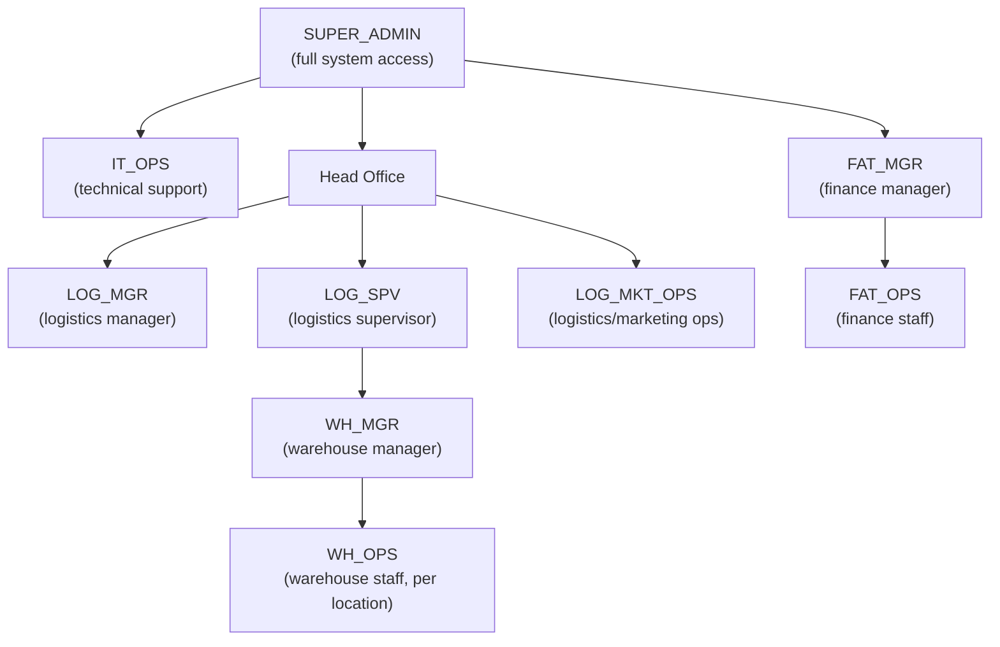

# User Accounts & Roles Guide

## 1. How accounts work

Every person who needs access to WAMS gets:

- A **login email** (in the format `code@gerbangcahayautama.com`, e.g. `whs.ops2@gerbangcahayautama.com`)
- A **default password**: `Password123` - the person should change this the first time they log in
- One **role**, which decides what they can see and do in the system
- For warehouse staff, one or more **provinces/warehouse locations** they are allowed to work in

Think of a "role" as a job badge: it decides which doors (features) a person can open in the app.

---

## 2. The roles, in plain English

| Role Code | Who this is for | What they can do |
|---|---|---|
| **SUPER_ADMIN** | System owner / top administrator | Full access to everything in the system, across all companies and warehouses. One person holds this role. |
| **IT_OPS** | Internal IT / technical support staff | Manages technical setup and system configuration. Not focused on day-to-day warehouse work. |
| **LOG_MGR** | Logistics Manager (Head Office) | Oversees logistics operations across all warehouses/provinces. Higher-level oversight role, not tied to one warehouse. |
| **LOG_SPV** | Logistics Supervisor (Head Office) | Supervises logistics activity day-to-day, same permission level as Logistics Manager but a supervisory title. |
| **LOG_MKT_OPS** | Logistics / Marketing Operations (Head Office) | Handles operational logistics and marketing-related tasks from Head Office. |
| **WH_MGR** | Warehouse Manager / Coordinator | Manages one or more assigned warehouses - coordinates staff and operations at the warehouse level. |
| **WH_OPS** | Warehouse Operator / Admin (on-site staff) | Day-to-day warehouse operations at a specific warehouse location (e.g. inbound/outbound stock, records). |
| **FAT_MGR** | Finance Manager | Oversees financial data and approvals. |
| **FAT_OPS** | Finance Operator | Handles day-to-day finance data entry and processing. |

> **Note:** These role permissions are placeholders copied from a template while the client confirms the final "who can do what" matrix. Review and sign off on them before go-live.

---

## 3. Where each role sits (org view)

---

## 4. Warehouse staff are tied to specific locations

Head Office roles work across every location. **Warehouse Manager (WH_MGR)** and **Warehouse Operator (WH_OPS)** accounts work differently: each one is assigned to one or more **provinces**, matching the physical warehouse where that person works.

- A warehouse operator in Medan sees and manages data for the Medan (Sumatera Utara) warehouse only
- That operator cannot see or touch data from other warehouses, such as Jakarta or Surabaya
- Head Office roles (Logistics, IT, Super Admin) see across all locations

---

## 5. Example accounts currently set up - ready to log in

These are the sample/test accounts already provisioned for this project, matching the client's user matrix. Use the email and password below to log in directly.

| Fullname | Role | Login Email | Password | Province Scope |
|---|---|---|---|---|
| Ferdy | SUPER_ADMIN | sa@gerbangcahayautama.com | Password123 | All |
| Yoseph | IT_OPS | it.adm1@gerbangcahayautama.com | Password123 | All |
| Fried | IT_OPS | it.adm2@gerbangcahayautama.com | Password123 | All |
| Ronaldo Rambi | LOG_MGR | log.mgr1@gerbangcahayautama.com | Password123 | All |
| Teammy Setiawan | LOG_SPV | log.ho1@gerbangcahayautama.com | Password123 | All |
| Wiwit | LOG_MKT_OPS | log.ho2@gerbangcahayautama.com | Password123 | All |
| Maya | LOG_MKT_OPS | log.ho3@gerbangcahayautama.com | Password123 | All |
| Yovin | WH_MGR | whs.coor1@gerbangcahayautama.com | Password123 | Jawa Tengah, Jawa Timur, Nusa Tenggara Barat, Sulawesi Tengah, Sulawesi Selatan, Kalimantan Timur |
| Yohan | WH_MGR | whs.coor2@gerbangcahayautama.com | Password123 | Sumatera Utara, Lampung, Jambi, Jakarta |
| Ridwan Nasution | WH_OPS | whs.ops1@gerbangcahayautama.com | Password123 | Sumatera Utara |
| Admin Gdg Medan | WH_OPS | whs.ops2@gerbangcahayautama.com | Password123 | Sumatera Utara |
| Admin Gdg Lampung | WH_OPS | whs.ops3@gerbangcahayautama.com | Password123 | Lampung, Jambi |
| Admin Gdg Jakarta | WH_OPS | whs.ops5@gerbangcahayautama.com | Password123 | Jakarta |
| Admin Gdg Surabaya | WH_OPS | whs.ops7@gerbangcahayautama.com | Password123 | Jawa Timur, Nusa Tenggara Barat, Sulawesi Tengah, Sulawesi Selatan |
| Suparno | WH_OPS | whs.ops9@gerbangcahayautama.com | Password123 | Jawa Tengah, Kalimantan Timur |
| Admin Gdg Semarang | WH_OPS | whs.ops10@gerbangcahayautama.com | Password123 | Jawa Tengah, Kalimantan Timur |
| Eldi | FAT_MGR | fat.mgr1@gerbangcahayautama.com | Password123 | All |
| Eric | FAT_MGR | fat.mgr2@gerbangcahayautama.com | Password123 | All |
| Aziz | FAT_OPS | fat.ops1@gerbangcahayautama.com | Password123 | All |

> The Super Admin (Ferdy) account uses `sa@gerbangcahayautama.com` - all other accounts follow the pattern `[login code, lowercase]@gerbangcahayautama.com`, for example `whs.ops2@gerbangcahayautama.com`. Only WH_MGR and WH_OPS accounts carry a province scope - every other role sees data across all locations.

---

## 6. What each role can access, area by area

LOG_MGR and LOG_SPV share one permission set, as do LOG_MKT_OPS and WH_OPS, and FAT_MGR and FAT_OPS. The table groups them for that reason.

| Business Area | SUPER_ADMIN | IT_OPS | LOG_MGR / LOG_SPV | LOG_MKT_OPS / WH_OPS | WH_MGR | FAT_MGR / FAT_OPS |
|---|---|---|---|---|---|---|
| Users, roles, warehouse assignments | Full access | Full access | View + export | View own warehouse | View own warehouse | No access |
| System settings (companies, data sync) | Full access | Full access | No access | No access | No access | No access |
| Budget plans, templates & revisions | Full access | View only | Full access, including approve/reject | Create, edit, submit, delete (cannot approve) | View, approve, reject | View + export |
| Vendors, items, rate cards, units | Full access | View only | Full access | View + export | View + export | View + export |
| Purchase orders | Full access | View only | Full access | Full access | View + export | No access |
| Work orders (day-to-day operations) | Full access | View only | View + export | Full access | View + export, verify realization | No access |
| Work order billing & recap approval | Full access | View only | Full access, including approve/reject | Full access | View only | No access |
| Quality checks & documents | Full access | View only | No access | Full access | No access | No access |
| Cash advances | Full access | View only | View only | No access | No access | Full access |
| Reports & dashboards | Full access | View only | Full access, including export | View only | No access | Full access |
| Approval workflow templates | Full access | View only | Full access, including edit/delete | View only | View only | No access |

**What the labels mean:**
- **Full access** - create, edit, delete, and approve where that action applies
- **View + export** - read the data and download it, no changes allowed
- **View only** - read the data, no download or changes
- **No access** - the area doesn't appear for that role

> These access levels come directly from the placeholder role templates in the system (mirrored from HO_SPV, WAREHOUSE_ADMIN, COORDINATOR_WH, and FINANCE_USER). They're a working starting point, not the client's final sign-off matrix.